# [G21 - Yozusoft] Report
## Table of Contents

- [\[G21 - Yozusoft\] Report](#g0---team-name-report)
  - [Table of Contents](#table-of-contents)
  - [Administrative](#administrative)
  - [Team Members and Roles](#team-members-and-roles)
  - [Summary of Individual Contributions](#summary-of-individual-contributions)
  - [Application Description](#application-description)
    - [Problem Statement](#problem-statement)
    - [Application Use Cases and/or Examples](#application-use-cases-andor-examples)
    - [Application UML](#application-uml)
  - [Code Design and Decisions](#code-design-and-decisions)
    - [Data Structures](#data-structures)
    - [Design Patterns](#design-patterns)
    - [Parser](#parser)
    - [Grammar(s)](#grammars)
    - [Tokenizers and Parsers](#tokenizers-and-parsers)
      - [The advantages of the designs](#the-advantages-of-the-designs)
    - [Others](#others)
  - [Implemented Features](#implemented-features)
    - [Basic Features](#basic-features)
    - [Custom Features](#custom-features)
    - [Surprise Feature](#surprise-feature)
  - [Testing Summary](#testing-summary)
  - [Summary of Known Errors and Bugs](#summary-of-known-errors-and-bugs)
  - [Team Management](#team-management)
    - [Meeting Minutes](#meeting-minutes)
    - [Conflict Resolution Protocol](#conflict-resolution-protocol)

## Administrative

*Instruction: please place the CORRECT link to your firebase repository here (with comp21006442@gmail.com added as an Editor)*

- Firebase Repository Link: https://console.firebase.google.com/u/0/project/groupwork-c2a12/firestore/databases/-default-/data // TODO
   - Confirm: [x] I have already added comp21006442@gmail.com as a Editor to the Firebase project prior to due date.
- Two user accounts for markers' access are usable on the app's APK (do not change the username and password unless there are exceptional circumstances. Note that they are not real e-mail addresses in use):
   - Credentials removed from the public version.

## Team Members and Roles
The key area(s) of responsibilities for each member
| UID      |     Name     |                                                                   Role |
|:---------|:------------:|-----------------------------------------------------------------------:|
| [uid]    |    [name]    |                                                                 [role] |
| u7735222 | Shangyi Shen |         implement p2p message, firestore login, junit, UXUI,UI feedback|
| u7904927 |  Lanping Hu  | implement 3 design patterns & notification datasream & graphical report |
| u7905060 | Hanjian Jin  |                                    Connect firebase, Implement UI-test |
| u7782042 | Daoyan Zhu   | Programme and UI design; implement basic feature 5(search),6(UXUI),7(UI feedback), Junit test, privacy block  |
| u7403710 | Jiahe Qian   |                                Custom map, location list click and show|


## Summary of Individual Contributions
1. **u7782042, Daoyan Zhu**  I have 20% contribution, as follows: <br>
  - **Code Contribution in the final App**
    - **Basic feature 5: Search**
      - in message page if you click the icon in the upper right corner then you can go to find friend page.
      - After you enter input in that EditText view and click the search icon the search task will run.
      - After user see "search finished", then user can click show result button to see the result.
      - class `TokenForFindFriend.java`:[TokenForFindFriend.java](https://gitlab.cecs.anu.edu.au/u7782042/gp-24s2/-/blob/main/androidProgram/app/src/main/java/com/example/smartcity/tools/tokenTokenizer/TokenForFindFriend.java?ref_type=heads)
      - class `TokenizerForFindFriend.java`:[TokenizerForFindFriend.java](https://gitlab.cecs.anu.edu.au/u7782042/gp-24s2/-/blob/main/androidProgram/app/src/main/java/com/example/smartcity/tools/tokenTokenizer/TokenizerForFindFriend.java?ref_type=heads)
      - class `Exp.java`:[Exp.java](https://gitlab.cecs.anu.edu.au/u7782042/gp-24s2/-/blob/main/androidProgram/app/src/main/java/com/example/smartcity/tools/expParser/Exp.java?ref_type=heads)
      - class `FinalExp.java`:[FinalExp.java](https://gitlab.cecs.anu.edu.au/u7782042/gp-24s2/-/blob/main/androidProgram/app/src/main/java/com/example/smartcity/tools/expParser/FinalExp.java?ref_type=heads)
      - class `StringExp.java`:[StringExp.java](https://gitlab.cecs.anu.edu.au/u7782042/gp-24s2/-/blob/main/androidProgram/app/src/main/java/com/example/smartcity/tools/expParser/StringExp.java?ref_type=heads)
      - class `SemicolonExp.java`:[SemicolonExp.java](https://gitlab.cecs.anu.edu.au/u7782042/gp-24s2/-/blob/main/androidProgram/app/src/main/java/com/example/smartcity/tools/expParser/SemicolonExp.java?ref_type=heads)
      - class `AccountExp.java`:[AccountExp.java](https://gitlab.cecs.anu.edu.au/u7782042/gp-24s2/-/blob/main/androidProgram/app/src/main/java/com/example/smartcity/tools/expParser/AccountExp.java?ref_type=heads)
      - class `UsernameExp.java`:[UsernameExp.java](https://gitlab.cecs.anu.edu.au/u7782042/gp-24s2/-/blob/main/androidProgram/app/src/main/java/com/example/smartcity/tools/expParser/UsernameExp.java?ref_type=heads)
      - class `ParserForFindFriend.java`:[ParserForFindFriend.java](https://gitlab.cecs.anu.edu.au/u7782042/gp-24s2/-/blob/main/androidProgram/app/src/main/java/com/example/smartcity/tools/expParser/ParserForFindFriend.java?ref_type=heads)
      - class `SearchExe.java`:[SearchExe.java](https://gitlab.cecs.anu.edu.au/u7782042/gp-24s2/-/blob/main/androidProgram/app/src/main/java/com/example/smartcity/tools/expParser/SearchExe.java?ref_type=heads)
    - **Basic feature 6: UXUI**
      - **layout**
        - xml file `accountsettings.xml`:[accountsettings.xml](https://gitlab.cecs.anu.edu.au/u7782042/gp-24s2/-/blob/main/androidProgram/app/src/main/res/layout/accountsettings.xml?ref_type=heads)
        - xml file `accountsettings_age_picker.xml`:[accountsettings_age_picker.xml](https://gitlab.cecs.anu.edu.au/u7782042/gp-24s2/-/blob/main/androidProgram/app/src/main/res/layout/accountsettings_age_picker.xml?ref_type=heads)
        - xml file `accountsettings_gender_select.xml`:[accountsettings_gender_select.xml](https://gitlab.cecs.anu.edu.au/u7782042/gp-24s2/-/blob/main/androidProgram/app/src/main/res/layout/accountsettings_gender_select.xml?ref_type=heads)
        - xml file `accountsettings_new_username.xml`:[accountsettings_new_username.xml](https://gitlab.cecs.anu.edu.au/u7782042/gp-24s2/-/blob/main/androidProgram/app/src/main/res/layout/accountsettings_new_username.xml?ref_type=heads)
        - xml file `accountsettings_privacy.xml`:[accountsettings_privacy.xml](https://gitlab.cecs.anu.edu.au/u7782042/gp-24s2/-/blob/main/androidProgram/app/src/main/res/layout/accountsettings_privacy.xml?ref_type=heads)
        - xml file `activity_log_in.xml`:[activity_log_in.xml](https://gitlab.cecs.anu.edu.au/u7782042/gp-24s2/-/blob/main/androidProgram/app/src/main/res/layout/activity_log_in.xml?ref_type=heads)
        - xml file `activity_password_reset.xml`:[activity_password_reset.xml](https://gitlab.cecs.anu.edu.au/u7782042/gp-24s2/-/blob/main/androidProgram/app/src/main/res/layout/activity_password_reset.xml?ref_type=heads)
        - xml file `activity_sign_up.xml`:[activity_sign_up.xml](https://gitlab.cecs.anu.edu.au/u7782042/gp-24s2/-/blob/main/androidProgram/app/src/main/res/layout/activity_sign_up.xml?ref_type=heads)
        - xml file `activity_start.xml`:[activity_start.xml](https://gitlab.cecs.anu.edu.au/u7782042/gp-24s2/-/blob/main/androidProgram/app/src/main/res/layout/activity_start.xml?ref_type=heads)
        - xml file `bookingpage.xml`:[bookingpage.xml](https://gitlab.cecs.anu.edu.au/u7782042/gp-24s2/-/blob/main/androidProgram/app/src/main/res/layout/bookingpage.xml?ref_type=heads)
        - xml file `find_new_friend.xml`:[find_new_friend.xml](https://gitlab.cecs.anu.edu.au/u7782042/gp-24s2/-/blob/main/androidProgram/app/src/main/res/layout/find_new_friend.xml?ref_type=heads)
        - xml file `find_new_friend_age_range_filter.xml`:[find_new_friend_age_range_filter.xml](https://gitlab.cecs.anu.edu.au/u7782042/gp-24s2/-/blob/main/androidProgram/app/src/main/res/layout/find_new_friend_age_range_filter.xml?ref_type=heads)
        - xml file `homepage.xml`:[homepage.xml](https://gitlab.cecs.anu.edu.au/u7782042/gp-24s2/-/blob/main/androidProgram/app/src/main/res/layout/homepage.xml?ref_type=heads)
        - xml file `managebooking.xml`:[managebooking.xml](https://gitlab.cecs.anu.edu.au/u7782042/gp-24s2/-/blob/main/androidProgram/app/src/main/res/layout/managebooking.xml?ref_type=heads)
        - xml file `messagepage.xml`:[messagepage.xml](https://gitlab.cecs.anu.edu.au/u7782042/gp-24s2/-/blob/main/androidProgram/app/src/main/res/layout/messagepage.xml?ref_type=heads)
        - xml file `noticepage.xml`:[noticepage.xml](https://gitlab.cecs.anu.edu.au/u7782042/gp-24s2/-/blob/main/androidProgram/app/src/main/res/layout/noticepage.xml?ref_type=heads)
        - xml file `notificationsetting.xml`:[notificationsetting.xml](https://gitlab.cecs.anu.edu.au/u7782042/gp-24s2/-/blob/main/androidProgram/app/src/main/res/layout/notificationsetting.xml?ref_type=heads)
        - xml file `p2pmessage_more_click.xml`:[p2pmessage_more_click.xml](https://gitlab.cecs.anu.edu.au/u7782042/gp-24s2/-/blob/main/androidProgram/app/src/main/res/layout/p2pmessage_more_click.xml?ref_type=heads)
        - xml file `reportingpage1.xml`:[reportingpage1.xml](https://gitlab.cecs.anu.edu.au/u7782042/gp-24s2/-/blob/main/androidProgram/app/src/main/res/layout/reportingpage1.xml?ref_type=heads)
        - xml file `reportingpage2.xml`:[reportingpage2.xml](https://gitlab.cecs.anu.edu.au/u7782042/gp-24s2/-/blob/main/androidProgram/app/src/main/res/layout/reportingpage2.xml?ref_type=heads)
        - xml file `searchpage.xml`:[searchpage.xml](https://gitlab.cecs.anu.edu.au/u7782042/gp-24s2/-/blob/main/androidProgram/app/src/main/res/layout/searchpage.xml?ref_type=heads)
      - **layout land**
        - xml file `accountsettings.xml`:[accountsettings.xml](https://gitlab.cecs.anu.edu.au/u7782042/gp-24s2/-/blob/main/androidProgram/app/src/main/res/layout-land/accountsettings.xml?ref_type=heads)
        - xml file `activity_log_in.xml`:[activity_log_in.xml](https://gitlab.cecs.anu.edu.au/u7782042/gp-24s2/-/blob/main/androidProgram/app/src/main/res/layout-land/activity_log_in.xml?ref_type=heads)
        - xml file `activity_password_reset.xml`:[activity_password_reset.xml](https://gitlab.cecs.anu.edu.au/u7782042/gp-24s2/-/blob/main/androidProgram/app/src/main/res/layout-land/activity_password_reset.xml?ref_type=heads)
        - xml file `activity_sign_up.xml`:[activity_sign_up.xml](https://gitlab.cecs.anu.edu.au/u7782042/gp-24s2/-/blob/main/androidProgram/app/src/main/res/layout-land/activity_sign_up.xml?ref_type=heads)
        - xml file `activity_start.xml`:[activity_start.xml](https://gitlab.cecs.anu.edu.au/u7782042/gp-24s2/-/blob/main/androidProgram/app/src/main/res/layout-land/activity_start.xml?ref_type=heads)
        - xml file `bookingpage.xml`:[bookingpage.xml](https://gitlab.cecs.anu.edu.au/u7782042/gp-24s2/-/blob/main/androidProgram/app/src/main/res/layout-land/bookingpage.xml?ref_type=heads)
        - xml file `find_new_friend.xml`:[find_new_friend.xml](https://gitlab.cecs.anu.edu.au/u7782042/gp-24s2/-/blob/main/androidProgram/app/src/main/res/layout-land/find_new_friend.xml?ref_type=heads)
        - xml file `homepage.xml`:[homepage.xml](https://gitlab.cecs.anu.edu.au/u7782042/gp-24s2/-/blob/main/androidProgram/app/src/main/res/layout-land/homepage.xml?ref_type=heads)
        - xml file `managebooking.xml`:[managebooking.xml](https://gitlab.cecs.anu.edu.au/u7782042/gp-24s2/-/blob/main/androidProgram/app/src/main/res/layout-land/managebooking.xml?ref_type=heads)
        - xml file `messagepage.xml`:[messagepage.xml](https://gitlab.cecs.anu.edu.au/u7782042/gp-24s2/-/blob/main/androidProgram/app/src/main/res/layout-land/messagepage.xml?ref_type=heads)
        - xml file `noticepage.xml`:[noticepage.xml](https://gitlab.cecs.anu.edu.au/u7782042/gp-24s2/-/blob/main/androidProgram/app/src/main/res/layout-land/noticepage.xml?ref_type=heads)
        - xml file `notificationsetting.xml`:[notificationsetting.xml](https://gitlab.cecs.anu.edu.au/u7782042/gp-24s2/-/blob/main/androidProgram/app/src/main/res/layout-land/notificationsetting.xml?ref_type=heads)
        - xml file `reportingpage1.xml`:[reportingpage1.xml](https://gitlab.cecs.anu.edu.au/u7782042/gp-24s2/-/blob/main/androidProgram/app/src/main/res/layout-land/reportingpage1.xml?ref_type=heads)
        - xml file `reportingpage2.xml`:[reportingpage2.xml](https://gitlab.cecs.anu.edu.au/u7782042/gp-24s2/-/blob/main/androidProgram/app/src/main/res/layout-land/reportingpage2.xml?ref_type=heads)
        - xml file `searchpage.xml`:[searchpage.xml](https://gitlab.cecs.anu.edu.au/u7782042/gp-24s2/-/blob/main/androidProgram/app/src/main/res/layout-land/searchpage.xml?ref_type=heads)
    - **Custom feature : Privacy-Block**
      - block or unblock users:[P2PMessage.java](https://gitlab.cecs.anu.edu.au/u7782042/gp-24s2/-/blob/main/androidProgram/app/src/main/java/com/example/smartcity/P2PMessage.java?ref_type=heads#L252-296)
      - If A is in B super black list(B use privacy-block to block A) when A search B's account:[AccountExp.java](https://gitlab.cecs.anu.edu.au/u7782042/gp-24s2/-/blob/main/androidProgram/app/src/main/java/com/example/smartcity/tools/expParser/AccountExp.java?ref_type=heads#L110-138)
      - If A is in B super black list(B use privacy-block to block A) when A search B's name:[UsernameExp.java](https://gitlab.cecs.anu.edu.au/u7782042/gp-24s2/-/blob/main/androidProgram/app/src/main/java/com/example/smartcity/tools/expParser/UsernameExp.java?ref_type=heads#L103-132)
      - If A is in B super black list(B use privacy-block to block A) when A search B's keyword:[InvalidSearch.java](https://gitlab.cecs.anu.edu.au/u7782042/gp-24s2/-/blob/main/androidProgram/app/src/main/java/com/example/smartcity/tools/expParser/InvalidSearch.java?ref_type=heads#L82-109)
    - **Others** 
      - **Add friend**
        - Search new friend:[FindNewFriend.java](https://gitlab.cecs.anu.edu.au/u7782042/gp-24s2/-/blob/main/androidProgram/app/src/main/java/com/example/smartcity/FindNewFriend.java?ref_type=heads#L92-139)
        - Show search result:[FindNewFriend.java](https://gitlab.cecs.anu.edu.au/u7782042/gp-24s2/-/blob/main/androidProgram/app/src/main/java/com/example/smartcity/FindNewFriend.java?ref_type=heads#L141-185)
        - select age range and gender:[FindNewFriend.java](https://gitlab.cecs.anu.edu.au/u7782042/gp-24s2/-/blob/main/androidProgram/app/src/main/java/com/example/smartcity/FindNewFriend.java?ref_type=heads#L223-300)
      - **Account Settings**
        - Change user name:[AccountSettings.java](https://gitlab.cecs.anu.edu.au/u7782042/gp-24s2/-/blob/main/androidProgram/app/src/main/java/com/example/smartcity/AccountSettings.java?ref_type=heads#L126-189)
        - Set up age:[AccountSettings.java](https://gitlab.cecs.anu.edu.au/u7782042/gp-24s2/-/blob/main/androidProgram/app/src/main/java/com/example/smartcity/AccountSettings.java?ref_type=heads#L192-217)
        - Set up gender:[AccountSettings.java](https://gitlab.cecs.anu.edu.au/u7782042/gp-24s2/-/blob/main/androidProgram/app/src/main/java/com/example/smartcity/AccountSettings.java?ref_type=heads#L220-249)
        - Go to Password Reset Page:[AccountSettings.java](https://gitlab.cecs.anu.edu.au/u7782042/gp-24s2/-/blob/main/androidProgram/app/src/main/java/com/example/smartcity/AccountSettings.java?ref_type=heads#L251-255)
        - Delete account:[AccountSettings.java](https://gitlab.cecs.anu.edu.au/u7782042/gp-24s2/-/blob/main/androidProgram/app/src/main/java/com/example/smartcity/AccountSettings.java?ref_type=heads#L257-308)
        - Log off:[AccountSettings.java](https://gitlab.cecs.anu.edu.au/u7782042/gp-24s2/-/blob/main/androidProgram/app/src/main/java/com/example/smartcity/AccountSettings.java?ref_type=heads#L310-332)
        - Privacy settings:[AccountSettings.java](https://gitlab.cecs.anu.edu.au/u7782042/gp-24s2/-/blob/main/androidProgram/app/src/main/java/com/example/smartcity/AccountSettings.java?ref_type=heads#L334-376)
        - check is new user name valid:[AccountSettings.java](https://gitlab.cecs.anu.edu.au/u7782042/gp-24s2/-/blob/main/androidProgram/app/src/main/java/com/example/smartcity/AccountSettings.java?ref_type=heads#L468-482)
      - **Peer to Peer message option**
        - delete/block/super-block:[P2PMessage.java](https://gitlab.cecs.anu.edu.au/u7782042/gp-24s2/-/blob/main/androidProgram/app/src/main/java/com/example/smartcity/P2PMessage.java?ref_type=heads#L137-303)
      - **Password reset**
        - class `PasswordReset.java`:[PasswordReset.java](https://gitlab.cecs.anu.edu.au/u7782042/gp-24s2/-/blob/main/androidProgram/app/src/main/java/com/example/smartcity/PasswordReset.java?ref_type=heads)
      - **Search name by key words**
        - class `InvalidSearch.java`:[InvalidSearch.java](https://gitlab.cecs.anu.edu.au/u7782042/gp-24s2/-/blob/main/androidProgram/app/src/main/java/com/example/smartcity/tools/expParser/InvalidSearch.java?ref_type=heads)
      - **Manage Booking**
        - class `ManageBooking.java`:[ManageBooking.java](https://gitlab.cecs.anu.edu.au/u7782042/gp-24s2/-/blob/main/androidProgram/app/src/main/java/com/example/smartcity/ManageBooking.java?ref_type=heads)
        - check if booking already exist:[HomePage.java](https://gitlab.cecs.anu.edu.au/u7782042/gp-24s2/-/blob/main/androidProgram/app/src/main/java/com/example/smartcity/HomePage.java?ref_type=heads#L84-101)
        - clear existed booking when user want to book another place:[BookingPage.java](https://gitlab.cecs.anu.edu.au/u7782042/gp-24s2/-/blob/main/androidProgram/app/src/main/java/com/example/smartcity/BookingPage.java?ref_type=heads#L190-235)
      - **Online status**
        - **Set online**
          - enter Account settings page:[AccountSettings.java](https://gitlab.cecs.anu.edu.au/u7782042/gp-24s2/-/blob/main/androidProgram/app/src/main/java/com/example/smartcity/AccountSettings.java?ref_type=heads#L415-421)
          - enter booking page:[BookingPage.java](https://gitlab.cecs.anu.edu.au/u7782042/gp-24s2/-/blob/main/androidProgram/app/src/main/java/com/example/smartcity/BookingPage.java?ref_type=heads#L237-244)
          - enter find friend page:[FindNewFriend.java](https://gitlab.cecs.anu.edu.au/u7782042/gp-24s2/-/blob/main/androidProgram/app/src/main/java/com/example/smartcity/FindNewFriend.java?ref_type=heads#L332-339)
          - enter find (location) page:[FindPage.java](https://gitlab.cecs.anu.edu.au/u7782042/gp-24s2/-/blob/main/androidProgram/app/src/main/java/com/example/smartcity/FindPage.java?ref_type=heads#L32-39)
          - enter friend request page:[FriendRequest.java](https://gitlab.cecs.anu.edu.au/u7782042/gp-24s2/-/blob/main/androidProgram/app/src/main/java/com/example/smartcity/FriendRequest.java?ref_type=heads#L175-183)
          - enter home page:[HomePage.java](https://gitlab.cecs.anu.edu.au/u7782042/gp-24s2/-/blob/main/androidProgram/app/src/main/java/com/example/smartcity/HomePage.java?ref_type=heads#L231-239)
          - enter manage booking page:[ManageBooking.java](https://gitlab.cecs.anu.edu.au/u7782042/gp-24s2/-/blob/main/androidProgram/app/src/main/java/com/example/smartcity/ManageBooking.java?ref_type=heads#L35-42)
          - enter message page:[MessagePage.java](https://gitlab.cecs.anu.edu.au/u7782042/gp-24s2/-/blob/main/androidProgram/app/src/main/java/com/example/smartcity/MessagePage.java?ref_type=heads#L163-166)
          - enter my page:[MyPage.java](https://gitlab.cecs.anu.edu.au/u7782042/gp-24s2/-/blob/main/androidProgram/app/src/main/java/com/example/smartcity/MyPage.java?ref_type=heads#L145-148)
          - enter notice page:[NoticePage.java](https://gitlab.cecs.anu.edu.au/u7782042/gp-24s2/-/blob/main/androidProgram/app/src/main/java/com/example/smartcity/NoticePage.java?ref_type=heads#L70-77)
          - enter notifications settings:[NotificationSetting.java](https://gitlab.cecs.anu.edu.au/u7782042/gp-24s2/-/blob/main/androidProgram/app/src/main/java/com/example/smartcity/NotificationSetting.java?ref_type=heads#L107-115)
          - enter peer to peer message page:[P2PMessage.java](https://gitlab.cecs.anu.edu.au/u7782042/gp-24s2/-/blob/main/androidProgram/app/src/main/java/com/example/smartcity/P2PMessage.java?ref_type=heads#L81-87)
          - enter the first report page:[Report1.java](https://gitlab.cecs.anu.edu.au/u7782042/gp-24s2/-/blob/main/androidProgram/app/src/main/java/com/example/smartcity/Report1.java?ref_type=heads#L27-35)
          - enter the second report page:[Report2.java](https://gitlab.cecs.anu.edu.au/u7782042/gp-24s2/-/blob/main/androidProgram/app/src/main/java/com/example/smartcity/Report2.java?ref_type=heads#L31-39)
        - **Set offline**
          - log off:[AccountSettings.java](https://gitlab.cecs.anu.edu.au/u7782042/gp-24s2/-/blob/main/androidProgram/app/src/main/java/com/example/smartcity/AccountSettings.java?ref_type=heads#L313-316)
          - leave Account settings page:[AccountSettings.java](https://gitlab.cecs.anu.edu.au/u7782042/gp-24s2/-/blob/main/androidProgram/app/src/main/java/com/example/smartcity/AccountSettings.java?ref_type=heads#L443-450)
          - leave booking page:[BookingPage.java](https://gitlab.cecs.anu.edu.au/u7782042/gp-24s2/-/blob/main/androidProgram/app/src/main/java/com/example/smartcity/BookingPage.java?ref_type=heads#L246-253)
          - leave find friend page:[FindNewFriend.java](https://gitlab.cecs.anu.edu.au/u7782042/gp-24s2/-/blob/main/androidProgram/app/src/main/java/com/example/smartcity/FindNewFriend.java?ref_type=heads#L341-348)
          - leave find (location) page:[FindPage.java](https://gitlab.cecs.anu.edu.au/u7782042/gp-24s2/-/blob/main/androidProgram/app/src/main/java/com/example/smartcity/FindPage.java?ref_type=heads#L41-50)
          - leave friend request page:[FriendRequest.java](https://gitlab.cecs.anu.edu.au/u7782042/gp-24s2/-/blob/main/androidProgram/app/src/main/java/com/example/smartcity/FriendRequest.java?ref_type=heads#L185-192)
          - leave home page:[HomePage.java](https://gitlab.cecs.anu.edu.au/u7782042/gp-24s2/-/blob/main/androidProgram/app/src/main/java/com/example/smartcity/HomePage.java?ref_type=heads#L241-250)
          - leave manage booking page:[ManageBooking.java](https://gitlab.cecs.anu.edu.au/u7782042/gp-24s2/-/blob/main/androidProgram/app/src/main/java/com/example/smartcity/ManageBooking.java?ref_type=heads#L44-51)
          - leave message page:[MessagePage.java](https://gitlab.cecs.anu.edu.au/u7782042/gp-24s2/-/blob/main/androidProgram/app/src/main/java/com/example/smartcity/MessagePage.java?ref_type=heads#L173-180)
          - leave my page:[MyPage.java](https://gitlab.cecs.anu.edu.au/u7782042/gp-24s2/-/blob/main/androidProgram/app/src/main/java/com/example/smartcity/MyPage.java?ref_type=heads#L161-169)
          - leave notice page:[NoticePage.java](https://gitlab.cecs.anu.edu.au/u7782042/gp-24s2/-/blob/main/androidProgram/app/src/main/java/com/example/smartcity/NoticePage.java?ref_type=heads#L79-85)
          - leave notifications settings:[NotificationSetting.java](https://gitlab.cecs.anu.edu.au/u7782042/gp-24s2/-/blob/main/androidProgram/app/src/main/java/com/example/smartcity/NotificationSetting.java?ref_type=heads#L118-126)
          - leave peer to peer message page:[P2PMessage.java](https://gitlab.cecs.anu.edu.au/u7782042/gp-24s2/-/blob/main/androidProgram/app/src/main/java/com/example/smartcity/P2PMessage.java?ref_type=heads#L89-95)
          - leave the first report page:[Report1.java](https://gitlab.cecs.anu.edu.au/u7782042/gp-24s2/-/blob/main/androidProgram/app/src/main/java/com/example/smartcity/Report1.java?ref_type=heads#L36-43)
          - leave the first report page:[Report1.java](https://gitlab.cecs.anu.edu.au/u7782042/gp-24s2/-/blob/main/androidProgram/app/src/main/java/com/example/smartcity/Report2.java?ref_type=heads#L41-48)
        - **Junit test**
          - test  `AVLTest.java` :[AVLTest.java](https://gitlab.cecs.anu.edu.au/u7782042/gp-24s2/-/blob/main/androidProgram/app/src/test/java/com/example/smartcity/AVLTest.java?ref_type=heads)
          - test `ConvertIntTimeToFloatTimeTest.java`:[ConvertIntTimeToFloatTimeTest.java](https://gitlab.cecs.anu.edu.au/u7782042/gp-24s2/-/blob/main/androidProgram/app/src/test/java/com/example/smartcity/ConvertIntTimeToFloatTimeTest.java?ref_type=heads)
          - test `ConvertTimeToFloatTest.java`:[ConvertTimeToFloatTest.java](https://gitlab.cecs.anu.edu.au/u7782042/gp-24s2/-/blob/main/androidProgram/app/src/test/java/com/example/smartcity/ConvertTimeToFloatTest.java?ref_type=heads)
          - test `FinalExpTest.java`:[FinalExpTest.java](https://gitlab.cecs.anu.edu.au/u7782042/gp-24s2/-/blob/main/androidProgram/app/src/test/java/com/example/smartcity/FinalExpTest.java?ref_type=heads)
          - test `GenerateKeywordsTest.java`:[GenerateKeywordsTest.java](https://gitlab.cecs.anu.edu.au/u7782042/gp-24s2/-/blob/main/androidProgram/app/src/test/java/com/example/smartcity/GenerateKeywordsTest.java?ref_type=heads)
          - test `IsDatePassedTest.java`:[IsDatePassedTest.java](https://gitlab.cecs.anu.edu.au/u7782042/gp-24s2/-/blob/main/androidProgram/app/src/test/java/com/example/smartcity/IsDatePassedTest.java?ref_type=heads)
          - test `IsNewNameValidTest.java`:[IsNewNameValidTest.java](https://gitlab.cecs.anu.edu.au/u7782042/gp-24s2/-/blob/main/androidProgram/app/src/test/java/com/example/smartcity/IsNewNameValidTest.java?ref_type=heads)
          - test `IsTimeOverlappingTest.java`:[IsTimeOverlappingTest.java](https://gitlab.cecs.anu.edu.au/u7782042/gp-24s2/-/blob/main/androidProgram/app/src/test/java/com/example/smartcity/IsTimeOverlappingTest.java?ref_type=heads)
          - test `SemicolonExpTest.java`:[SemicolonExpTest.java](https://gitlab.cecs.anu.edu.au/u7782042/gp-24s2/-/blob/main/androidProgram/app/src/test/java/com/example/smartcity/SemicolonExpTest.java?ref_type=heads)
          - test `StringExpTest.java`:[StringExpTest.java](https://gitlab.cecs.anu.edu.au/u7782042/gp-24s2/-/blob/main/androidProgram/app/src/test/java/com/example/smartcity/StringExpTest.java?ref_type=heads)
          - test `TokenForFindFriendTest.java`:[TokenForFindFriendTest.java](https://gitlab.cecs.anu.edu.au/u7782042/gp-24s2/-/blob/main/androidProgram/app/src/test/java/com/example/smartcity/TokenForFindFriendTest.java?ref_type=heads)
          - test `TokenizerForFindFriendTest.java`:[TokenizerForFindFriendTest.java](https://gitlab.cecs.anu.edu.au/u7782042/gp-24s2/-/blob/main/androidProgram/app/src/test/java/com/example/smartcity/TokenizerForFindFriendTest.java?ref_type=heads)
  - **Code and App Design** 
    - **AVLTREE**
      - Import tree- binary search tree AVL tree that I completed in lab.[package com.example.smartcity.tree](https://gitlab.cecs.anu.edu.au/u7782042/gp-24s2/-/tree/main/androidProgram/app/src/main/java/com/example/smartcity/tree?ref_type=heads)
      - By implementing constructor AVLtree(); to create an AVLtree with no element: [AVLTree.java](https://gitlab.cecs.anu.edu.au/u7782042/gp-24s2/-/blob/main/androidProgram/app/src/main/java/com/example/smartcity/tree/AVLTree.java?ref_type=heads#L17-21)
      - Add .delete() and .delete1() two ways to remove element in AVL tree: [AVLTree.java](https://gitlab.cecs.anu.edu.au/u7782042/gp-24s2/-/blob/main/androidProgram/app/src/main/java/com/example/smartcity/tree/AVLTree.java?ref_type=heads#L141-209)
    - **Design what this app aims to do**
      - this app is for people to book stadiums and parks and etc. around Canberra. 
    - **Design and implement all ui layout**
      - I provide a basic version of ui layout at first week and other group members can optimize this layout.
    - <br><br>

  - **Others**: (only if significant and significantly different from an "average contribution")
    - **fix bugs, figure out collapse**
      - collapse in reporting
      - bugs in booking
      - collapse in searching
      - show search result 
    - video create
    - <br><br>

2.  **u7904927, Lanping Hu** I have **20%** contribution, as follows:<br>
  - **Code Contribution in the final App**
    - **basic feature 4: Datastream**
      - **Notification Handling** 
         - class `BookingPlaceReportHandler`: [BookingPlaceReportHandler.java](https://gitlab.cecs.anu.edu.au/u7782042/gp-24s2/-/blob/main/androidProgram/app/src/main/java/com/example/smartcity/notifications/BookingPlaceReportHandler.java) 
         - class `BookingTimeNearHandler`: [BookingTimeNearHandler.java](https://gitlab.cecs.anu.edu.au/u7782042/gp-24s2/-/blob/main/androidProgram/app/src/main/java/com/example/smartcity/notifications/BookingTimeNearHandler.java)
         - class `FriendRequestHandler`: [FriendRequestHandler.java](https://gitlab.cecs.anu.edu.au/u7782042/gp-24s2/-/blob/main/androidProgram/app/src/main/java/com/example/smartcity/notifications/FriendRequestHandler.java)
         - class `NewMessageHandler`: [NewMessageHandler.java](https://gitlab.cecs.anu.edu.au/u7782042/gp-24s2/-/blob/main/androidProgram/app/src/main/java/com/example/smartcity/notifications/NewMessageHandler.java)
      - **Notification Settings** - class `NotificationSetting`: [NotificationSetting.java](https://gitlab.cecs.anu.edu.au/u7782042/gp-24s2/-/blob/main/androidProgram/app/src/main/java/com/example/smartcity/NotificationSetting.java)
      - **Notification Service** - class `NoticeService`: [NoticeService.java](https://gitlab.cecs.anu.edu.au/u7782042/gp-24s2/-/blob/main/androidProgram/app/src/main/java/com/example/smartcity/tools/NoticeService.java)
      - **Notification display** - class `Noticepage`: [NoticePage.java](https://gitlab.cecs.anu.edu.au/u7782042/gp-24s2/-/blob/main/androidProgram/app/src/main/java/com/example/smartcity/NoticePage.java)
    - **Factory Design Pattern** - class `NotificationHandlerFactory`: [NotificationHandlerFactory](https://gitlab.cecs.anu.edu.au/u7782042/gp-24s2/-/blob/main/androidProgram/app/src/main/java/com/example/smartcity/notifications/NotificationHandlerFactory.java#L9-44) and class folder [notifications](https://gitlab.cecs.anu.edu.au/u7782042/gp-24s2/-/blob/main/androidProgram/app/src/main/java/com/example/smartcity/notifications).
    - **Singleton Design Pattern** - class `User`: [User.getinstance()](https://gitlab.cecs.anu.edu.au/u7782042/gp-24s2/-/blob/main/androidProgram/app/src/main/java/com/example/smartcity/tools/User.java#L115-216)
    - **Observer Design Pattern** - class `Subject`: [Subject](https://gitlab.cecs.anu.edu.au/u7782042/gp-24s2/-/blob/main/androidProgram/app/src/main/java/com/example/smartcity/tools/Subject.java#L12-477) 
    - **Advanced feature: GraphicalReport** 
      - class `GraphicalReport`: [GraphicalReport.java](https://gitlab.cecs.anu.edu.au/u7782042/gp-24s2/-/blob/main/androidProgram/app/src/main/java/com/example/smartcity/GraphicalReport.java) 
      - class `BookingPage`:[BookingPage.java](https://gitlab.cecs.anu.edu.au/u7782042/gp-24s2/-/blob/main/androidProgram/app/src/main/java/com/example/smartcity/BookingPage.java#L314-373) 
      - class `Timeline`: [Timeline.java](https://gitlab.cecs.anu.edu.au/u7782042/gp-24s2/-/blob/main/androidProgram/app/src/main/java/com/example/smartcity/tools/Timeline.java) 
      - xml file `graphical_report.xml` : [graphical_report.xml](https://gitlab.cecs.anu.edu.au/u7782042/gp-24s2/-/blob/main/androidProgram/app/src/main/res/layout/graphical_report.xml?ref_type=heads)<br><br>
  - **Code and App Design**
    - **Design Patterns**
        - The `NotificationHandlerFactory` class implements the **Factory Design Pattern**  to instantiate appropriate `NotificationHandler` implementations based on the notification type.
        - The `User` class follows the **Singleton Design Pattern** , ensuring that only one instance of the user data exists throughout the application.
        -  The `Subject` class utilizes the **Observer Design Pattern** to manage and notify subscribers to one place about its new report.
    - **data structure**
      - **HashMaps and Lists:** Used extensively for managing user data, notifications, and booking information.
    - **UI Design**
        - The `Timeline` class utilizes `android.view` and `android.graphics` to provide an graphical representation of bookings. 
        - The layout is defined within [graphical_report.xml](https://gitlab.cecs.anu.edu.au/u7782042/gp-24s2/-/blob/main/androidProgram/app/src/main/res/layout/graphical_report.xml) and [bookingpage.xml](https://gitlab.cecs.anu.edu.au/u7782042/gp-24s2/-/blob/main/androidProgram/app/src/main/res/layout/bookingpage.xml).<br><br>
  - **Firestore Integration:** set up firestore safety rules and basic repositories.

3. **u7735222, Shangyi Shen** I have **20%** contribution, as follows:<br>
      - **Code Contribution in the final App**
        - **basic feature 1 : login**
          - **Sign Up Account** - class: `SignUp`: [SignUp.java](https://gitlab.cecs.anu.edu.au/u7782042/gp-24s2/-/blob/main/androidProgram/app/src/main/java/com/example/smartcity/SignUp.java)
          - **Log in** - class: `LogIn` : [LogIn.java](https://gitlab.cecs.anu.edu.au/u7782042/gp-24s2/-/blob/main/androidProgram/app/src/main/java/com/example/smartcity/LogIn.java)
          - **Check tools** - class: `Util`: [Util.java](https://gitlab.cecs.anu.edu.au/u7782042/gp-24s2/-/blob/main/androidProgram/app/src/main/java/com/example/smartcity/tools/Util.java)
        - **basic feature 6 : UXUI**
          - **Peer to Peer message UI** 
            - xml file `p2pmessage.xml`:[p2pmessage.xml](https://gitlab.cecs.anu.edu.au/u7782042/gp-24s2/-/blob/main/androidProgram/app/src/main/res/layout/p2pmessage.xml?ref_type=heads)
          - **Peer to Peer message UI(land)**
            - xml file `p2pmessage.xml`:[p2pmessage.xml](https://gitlab.cecs.anu.edu.au/u7782042/gp-24s2/-/blob/main/androidProgram/app/src/main/res/layout-land/p2pmessage.xml?ref_type=heads)
          - **Personal details** 
            - xml file `mypage.xml`:[mypage.xml](https://gitlab.cecs.anu.edu.au/u7782042/gp-24s2/-/blob/main/androidProgram/app/src/main/res/layout/mypage.xml?ref_type=heads)
          - **Personal details land**
            - xml file `mypage.xml`:[mypage.xml](https://gitlab.cecs.anu.edu.au/u7782042/gp-24s2/-/blob/main/androidProgram/app/src/main/res/layout-land/mypage.xml?ref_type=heads)
          - **Friend request**
            - xml file `friendrequest.xml`:[friendrequest.xml](https://gitlab.cecs.anu.edu.au/u7782042/gp-24s2/-/blob/main/androidProgram/app/src/main/res/layout/friendrequest.xml?ref_type=heads) 
          - **Friend request land**
            - xml file `friendrequest.xml`:[friendrequest.xml](https://gitlab.cecs.anu.edu.au/u7782042/gp-24s2/-/blob/main/androidProgram/app/src/main/res/layout-land/friendrequest.xml?ref_type=heads)
        - **key UI design** -elements: [ahead.xml](https://gitlab.cecs.anu.edu.au/u7782042/gp-24s2/-/blob/main/androidProgram/app/src/main/res/drawable/ahead.xml?ref_type=heads),
        - [homepage_normal.xml](https://gitlab.cecs.anu.edu.au/u7782042/gp-24s2/-/blob/main/androidProgram/app/src/main/res/drawable/homepage_normal.xml?ref_type=heads),[homepage_select.xml](https://gitlab.cecs.anu.edu.au/u7782042/gp-24s2/-/blob/main/androidProgram/app/src/main/res/drawable/homepage_select.xml?ref_type=heads),
        - [notice_normal.xml](https://gitlab.cecs.anu.edu.au/u7782042/gp-24s2/-/blob/main/androidProgram/app/src/main/res/drawable/notice_normal.xml?ref_type=heads),[notice_select.xml](https://gitlab.cecs.anu.edu.au/u7782042/gp-24s2/-/blob/main/androidProgram/app/src/main/res/drawable/notice_select.xml?ref_type=heads),
        - [my_normal.xml](https://gitlab.cecs.anu.edu.au/u7782042/gp-24s2/-/blob/main/androidProgram/app/src/main/res/drawable/my_normal.xml?ref_type=heads),[my_select.xml](https://gitlab.cecs.anu.edu.au/u7782042/gp-24s2/-/blob/main/androidProgram/app/src/main/res/drawable/my_select.xml?ref_type=heads)
        - [search_normal.xml](https://gitlab.cecs.anu.edu.au/u7782042/gp-24s2/-/blob/main/androidProgram/app/src/main/res/drawable/search_normal.xml?ref_type=heads),[search_select.xml](https://gitlab.cecs.anu.edu.au/u7782042/gp-24s2/-/blob/main/androidProgram/app/src/main/res/drawable/search_select.xml?ref_type=heads)
        - [person_ass.xml](https://gitlab.cecs.anu.edu.au/u7782042/gp-24s2/-/blob/main/androidProgram/app/src/main/res/drawable/person_add.xml?ref_type=heads),[man.xml](https://gitlab.cecs.anu.edu.au/u7782042/gp-24s2/-/blob/main/androidProgram/app/src/main/res/drawable/man.xml?ref_type=heads),[woman.xml](https://gitlab.cecs.anu.edu.au/u7782042/gp-24s2/-/blob/main/androidProgram/app/src/main/res/drawable/woman.xml?ref_type=heads)
        - [message_box_normal.xml](https://gitlab.cecs.anu.edu.au/u7782042/gp-24s2/-/blob/main/androidProgram/app/src/main/res/drawable/messagebox_normal.xml?ref_type=heads),[message_box_selected.xml](https://gitlab.cecs.anu.edu.au/u7782042/gp-24s2/-/blob/main/androidProgram/app/src/main/res/drawable/messagebox_select.xml?ref_type=heads)
        - [background_send.xml](https://gitlab.cecs.anu.edu.au/u7782042/gp-24s2/-/blob/main/androidProgram/app/src/main/res/drawable/background_send.xml?ref_type=heads),[background_send_input.xml](https://gitlab.cecs.anu.edu.au/u7782042/gp-24s2/-/blob/main/androidProgram/app/src/main/res/drawable/background_sendinput.xml?ref_type=heads),[background_send_message.xml](https://gitlab.cecs.anu.edu.au/u7782042/gp-24s2/-/blob/main/androidProgram/app/src/main/res/drawable/backdround_send_message.xml?ref_type=heads)
        - [background_receive_message.xml](https://gitlab.cecs.anu.edu.au/u7782042/gp-24s2/-/blob/main/androidProgram/app/src/main/res/drawable/background_receive_message.xml?ref_type=heads)
        - [man.xml](https://gitlab.cecs.anu.edu.au/u7782042/gp-24s2/-/blob/main/androidProgram/app/src/main/res/drawable/man.xml?ref_type=heads),[woman.xml](https://gitlab.cecs.anu.edu.au/u7782042/gp-24s2/-/blob/main/androidProgram/app/src/main/res/drawable/woman.xml?ref_type=heads)
        - **Message display** -layout : [item_container_receiver.xml](https://gitlab.cecs.anu.edu.au/u7782042/gp-24s2/-/blob/main/androidProgram/app/src/main/res/layout/item_container_receiver.xml?ref_type=heads);[item_container_send.xml](https://gitlab.cecs.anu.edu.au/u7782042/gp-24s2/-/blob/main/androidProgram/app/src/main/res/layout/item_container_send_message.xml?ref_type=heads)and[p2pmessage.xml](https://gitlab.cecs.anu.edu.au/u7782042/gp-24s2/-/blob/main/androidProgram/app/src/main/res/layout/p2pmessage.xml?ref_type=heads)
        - **Transition animation** - anim : [fade_in.xml](https://gitlab.cecs.anu.edu.au/u7782042/gp-24s2/-/blob/main/androidProgram/app/src/main/res/anim/fade_in.xml?ref_type=heads) and [fade_out.xml](https://gitlab.cecs.anu.edu.au/u7782042/gp-24s2/-/blob/main/androidProgram/app/src/main/res/anim/fade_out.xml?ref_type=heads)
        - **Advanced feature :P2P-DM**
          - **message object** -class: `Message` : [Message.java](https://gitlab.cecs.anu.edu.au/u7782042/gp-24s2/-/blob/main/androidProgram/app/src/main/java/com/example/smartcity/tools/Message.java)
          - **message container** -class: `MessageAdapter`:[MessageAdapter.java](https://gitlab.cecs.anu.edu.au/u7782042/gp-24s2/-/blob/main/androidProgram/app/src/main/java/com/example/smartcity/tools/MessageAdapter.java)
          - **select friend to chat** -class: `MessagePage` : [MessagePage.java](https://gitlab.cecs.anu.edu.au/u7782042/gp-24s2/-/blob/main/androidProgram/app/src/main/java/com/example/smartcity/MessagePage.java)
          - **p2p message** -class : `P2PMessage`: [P2PMessage.java](https://gitlab.cecs.anu.edu.au/u7782042/gp-24s2/-/blob/main/androidProgram/app/src/main/java/com/example/smartcity/P2PMessage.java)
          - **Avatar & message show for receiver** - xml file `item_container_receiver.xml`:[item_container_receiver.xml](https://gitlab.cecs.anu.edu.au/u7782042/gp-24s2/-/blob/main/androidProgram/app/src/main/res/layout/item_container_receiver.xml?ref_type=heads)
          - **Avatar & message show for sender** - xml file `item_container_send_message.xml`:[item_container_send_message.xml](https://gitlab.cecs.anu.edu.au/u7782042/gp-24s2/-/blob/main/androidProgram/app/src/main/res/layout/item_container_send_message.xml?ref_type=heads)
      - **Code and App Design**
        - **UI design**
         - **User profile display** -layout : [MyPage.xml](https://gitlab.cecs.anu.edu.au/u7782042/gp-24s2/-/blob/main/androidProgram/app/src/main/res/layout/mypage.xml?ref_type=heads) and [messagepage.xml](https://gitlab.cecs.anu.edu.au/u7782042/gp-24s2/-/blob/main/androidProgram/app/src/main/res/layout/messagepage.xml?ref_type=heads)
      - **Firestore Integration:** -use Firestore to implement login**
     - **Others**
     - **Basic feature 7: UIFeedback**
      - **Add friend**
        - **Send Friend Request** -class: [FindNewFriend.java](https://gitlab.cecs.anu.edu.au/u7782042/gp-24s2/-/blob/main/androidProgram/app/src/main/java/com/example/smartcity/FindNewFriend.java?ref_type=heads)
        - **Accept or Reject Request** -class: [FriendRequest.java](https://gitlab.cecs.anu.edu.au/u7782042/gp-24s2/-/blob/main/androidProgram/app/src/main/java/com/example/smartcity/FriendRequest.java?ref_type=heads)
      - **Set up gradle and APK**
      - **UI adjust and beautify**
      - **debugging, figure out collapse**
      - **code quality improving and warning reduction**

4.  **u7905060, Hanjian Jin** I have **20%** contribution, as follows:<br>
    - **Code Contribution in the final App**
        - **basic feature 2: DataFiles**
            - **Connect to Firebase**
                - class `User`: [User.java](https://gitlab.cecs.anu.edu.au/u7782042/gp-24s2/-/blob/main/androidProgram/app/src/main/java/com/example/smartcity/tools/User.java#L242-427)
                - class `BookingPage`: [BookingPage.java](https://gitlab.cecs.anu.edu.au/u7782042/gp-24s2/-/blob/main/androidProgram/app/src/main/java/com/example/smartcity/BookingPage.java#L291-317)
                - class `report1`: [Report1.java](https://gitlab.cecs.anu.edu.au/u7782042/gp-24s2/-/blob/main/androidProgram/app/src/main/java/com/example/smartcity/Report1.java#L56-103)
                - class `report2`: [Report2.java](https://gitlab.cecs.anu.edu.au/u7782042/gp-24s2/-/blob/main/androidProgram/app/src/main/java/com/example/smartcity/Report2.java#L56-112)
            - **Add valid instances** - class `UserGenerator`: [UserGenerator.java](https://gitlab.cecs.anu.edu.au/u7782042/gp-24s2/-/blob/main/androidProgram/app/src/main/java/com/example/smartcity/tools/UserGenerator.java)
        - **Advanced feature: UI-test**
            - class `AccountSettingsTest`: [AccountSettingsTest](https://gitlab.cecs.anu.edu.au/u7782042/gp-24s2/-/blob/main/androidProgram/app/src/androidTest/java/com/example/smartcity/AccountSettingsTest.java)
            - class `BookingPageTest`: [BookingPageTest](https://gitlab.cecs.anu.edu.au/u7782042/gp-24s2/-/blob/main/androidProgram/app/src/androidTest/java/com/example/smartcity/BookingPageTest.java)
            - class `FindNewFriendTest`: [FindNewFriendTest](https://gitlab.cecs.anu.edu.au/u7782042/gp-24s2/-/blob/main/androidProgram/app/src/androidTest/java/com/example/smartcity/FindNewFriendTest.java)
            - class `FriendRequestTest`: [FriendRequestTest](https://gitlab.cecs.anu.edu.au/u7782042/gp-24s2/-/blob/main/androidProgram/app/src/androidTest/java/com/example/smartcity/FriendRequestTest.java)
            - class `HomePageTest`: [HomePageTest](https://gitlab.cecs.anu.edu.au/u7782042/gp-24s2/-/blob/main/androidProgram/app/src/androidTest/java/com/example/smartcity/HomePageTest.java)
            - class `LogInTest`: [LogInTest](https://gitlab.cecs.anu.edu.au/u7782042/gp-24s2/-/blob/main/androidProgram/app/src/androidTest/java/com/example/smartcity/LogInTest.java)
            - class `ManageBookingTest`: [ManageBookingTest](https://gitlab.cecs.anu.edu.au/u7782042/gp-24s2/-/blob/main/androidProgram/app/src/androidTest/java/com/example/smartcity/ManageBookingTest.java)
            - class `MessagePageTest`: [MessagePageTest](https://gitlab.cecs.anu.edu.au/u7782042/gp-24s2/-/blob/main/androidProgram/app/src/androidTest/java/com/example/smartcity/MessagePageTest.java)
            - class `NoticePageTest`: [NoticePageTest](https://gitlab.cecs.anu.edu.au/u7782042/gp-24s2/-/blob/main/androidProgram/app/src/androidTest/java/com/example/smartcity/NoticePageTest.java)
            - class `NotificationSettingTest`: [NotificationSettingTest](https://gitlab.cecs.anu.edu.au/u7782042/gp-24s2/-/blob/main/androidProgram/app/src/androidTest/java/com/example/smartcity/NotificationSettingTest.java)
            - class `PasswordResetTest`: [PasswordResetTest](https://gitlab.cecs.anu.edu.au/u7782042/gp-24s2/-/blob/main/androidProgram/app/src/androidTest/java/com/example/smartcity/PasswordResetTest.java)
            - class `Report1Test`: [Report1Test](https://gitlab.cecs.anu.edu.au/u7782042/gp-24s2/-/blob/main/androidProgram/app/src/androidTest/java/com/example/smartcity/Report1Test.java)
            - class `Report2Test`: [Report2Test](https://gitlab.cecs.anu.edu.au/u7782042/gp-24s2/-/blob/main/androidProgram/app/src/androidTest/java/com/example/smartcity/Report2Test.java)
            - class `SignUpTest`: [SignUpTest](https://gitlab.cecs.anu.edu.au/u7782042/gp-24s2/-/blob/main/androidProgram/app/src/androidTest/java/com/example/smartcity/SignUpTest.java)
            - class `StartTest`: [StartTest](https://gitlab.cecs.anu.edu.au/u7782042/gp-24s2/-/blob/main/androidProgram/app/src/androidTest/java/com/example/smartcity/StartTest.java)
        - **Test UI**
            - Responsible for writing and executing UI tests to ensure the functionality of the application's user interface, and adjusting test cases according to requirements.
        - **uploading data to Firebase**
            - In charge of uploading data to Firebase and synchronizing the Firebase upload functions with the software development progress to ensure data reliability and consistency.

5. **u7403710, Jiahe Qian** I have **20%** contribution, as follows:<br>
    - **Code Contribution in the final App**
      - *Custom map*
        - A map written from scratch, which uses *Mapsforge*, a open-source map render, with .map binary file downloaded from open-source *OpenStreetMap*. With this custom map we would be able to realize localized, low-latency, high-performance rendering of city map and customized featured, compared with Google Map. It uses `.map` format vector map which is of high information-density. With clicking a location in the listview in `FindPage`, the app would automatically jump back to the map showing the custom icon and name rendered on the map, and location information passed to **Booking** and **Report** function which could be sent to Firebase.
        - **basic feature 2: LoadShowData**
            - **Load and show .map file of Canberra**
              - class `tools/mapsforge/CustomMapHandler`,[CustomMapHandler](https://gitlab.cecs.anu.edu.au/u7782042/gp-24s2/-/blob/main/androidProgram/app/src/main/java/com/example/smartcity/tools/mapsforge/CustomMapHandler.java?ref_type=heads)
                * mapfile: [sampple.map](https://gitlab.cecs.anu.edu.au/u7782042/gp-24s2/-/blob/main/androidProgram/app/src/main/assets/sample.map?ref_type=heads) 
                * `loadmap()` and `initializeMap()` methods
            - **Load map images**
              - class `tools/mapsforge/ImageLoader`, [ImageLoader](https://gitlab.cecs.anu.edu.au/u7782042/gp-24s2/-/blob/main/androidProgram/app/src/main/java/com/example/smartcity/tools/mapsforge/ImageLoader.java?ref_type=heads)
                * `loadScaledIcon()` loads a designiated icon in `.png` format stored in the `drawable` folder according to the given icon ID (byte), and returns it as an Android drawable object. 
            - **Renders the map, icons and locations**
              - class `tools/mapsforge/Renderer`,[Renderer](https://gitlab.cecs.anu.edu.au/u7782042/gp-24s2/-/blob/main/androidProgram/app/src/main/java/com/example/smartcity/tools/mapsforge/Renderer.java?ref_type=heads)
                * map rendered in `initializeMap()`
                * icons rendered by `renderIcon()` method in `Renderer` class.
                * location rendered by `renderSelectedLocation()` method in `Renderer` class.
                * User's location rendered by `renderUserLocation()` method in `Renderer` class.
          - **Custom Feature: Data-Format**
            - The custom map reads data from the `assets` folder for `.map` binary vector map file and `.csv` file for list of locations of stadiums and ovals around canberra.
              **Loads, parses location database and shows it in the Findpage**
              - class `tools/mapsforge/DataHandler`, [DataHandler](https://gitlab.cecs.anu.edu.au/u7782042/gp-24s2/-/blob/main/androidProgram/app/src/main/java/com/example/smartcity/tools/mapsforge/DataHandler.java?ref_type=heads)
              * Method: `initializeDataBase()` and `getDataListView()` for handling the data file. `findLocationByID` is used in the `FindPage` after a user clicks a location on the listview to index in the `customLocationArrayList`
              * Data File: `assets/places.csv`,[places.csv](https://gitlab.cecs.anu.edu.au/u7782042/gp-24s2/-/blob/main/androidProgram/app/src/main/assets/places.csv?ref_type=heads)
          - **Others**
            * Class: `CustomLocation` a class to create objects for each location initialized from the `locations.csv`. Each instance has `locationType`, `id`, `locationName`,`locationLatLong`(latitudes and longitudes). In SmartCity application, they're stored in the `customLocationArrayList` for easy and instant access.
            * Buggy custom feature-GPS: see in `tools/mapsforge/GPS` class [GPS](https://gitlab.cecs.anu.edu.au/u7782042/gp-24s2/-/blob/main/androidProgram/app/src/main/java/com/example/smartcity/tools/mapsforge/GPS.java?ref_type=heads)
              * `checkPermission()`: checks location permission, if not granted, asks for permission.
              * `showLastLocation()`: calls the `locationManager.getLastKnownLocation`, if successfully acquiring the user's location, renders the location icon on the map with `renderUserLocation` from the `Renderer` class.
              * Problems:
                * 1. `getLastKnownLocation` location is likely to return `null`, or a outdated location of the user (usually several hours agao).
                * 2. `showLastLocation` would only render once if it gets the location from `getLastKnownLocation`.
                * 3. `getLastKnownLocation` does not update user's live location.
                * 4. `LocationManager.requestLocationUpdates` and `fusedLocationProviderClient` are incompatible with the rendering methods in the `Render` class.
---     


## Application Description

SmartCity developed by `Yuzusoft` is a smart-city application that integrates map, social media and city venue booking functions all-in-one. SmartCity enables citizens of a modern city to interact with each other online in a secure, efficient platform in which their privacy is guaranteed. Users could message each other privately using this application. It also offers the chance to citizens to explore the city, by viewing, searching, booking and issue-reporting various outdoors venues including ovals and stadiums online, with a customized map that would still work without internet. It is also a mature social media platform in the sense that it offers a free space in which users could customize their account profile to show their unique personality by uploading their favorite avatars and freely change their usernames. 

### Problem Statement

1.**GPS acquiring and renderer compatibility problem**
The custom map has an unstable user live location feature which utilizes the system GPS (relative code could be found in `\tools\mapsforge\GPS.java`). The mapsforge renderer would not work if it being used in a actively updated GPS location manager, including both `fusedLocationProviderClient` and `LocationManager.requestLocationUpdates`. Both location APIs is returning user's live location coordinates as expected after debugging, and the problem is simply the renderer method never working with these two APIs. Therefore, the only compatible GPS API is `LocationManager.getLastKnownLocation`. However, the `getLastKnownLocation` is hardly updated by the Android system, even after acqruiring precise location permission from the user. As a consequence, the location is either not found from the API, or the location is the user's location several hours ago. 
Probably solutions are either using another map renderer, or  exploring GPS-relevant lower-level Android system integration to resolve the compatibility issues.

### Application Use Cases and/or Examples

Here are some cases when people should use our application. 

*A user wants to find and book an oval this afternoon to play footie with some friends**
1. The user opens the application and clicks on the find page
2. The user looks through the list of outdoor venues and clicks on **South Oval**
3. The application automatically jumps to the homepage, with the map automatically showing **South Oval** and an icon of a playground on the map
4. The user clicks `Booking` button
5. The booking page pops up and asks for user's desired time.
6. The user enters one's desired booking date and time, and clicks **confirm**.
7. The booking information is automatically sent to Firebase server
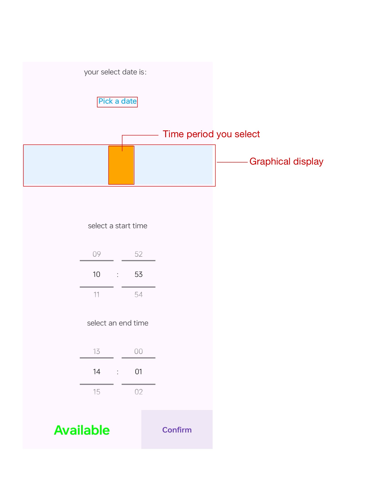
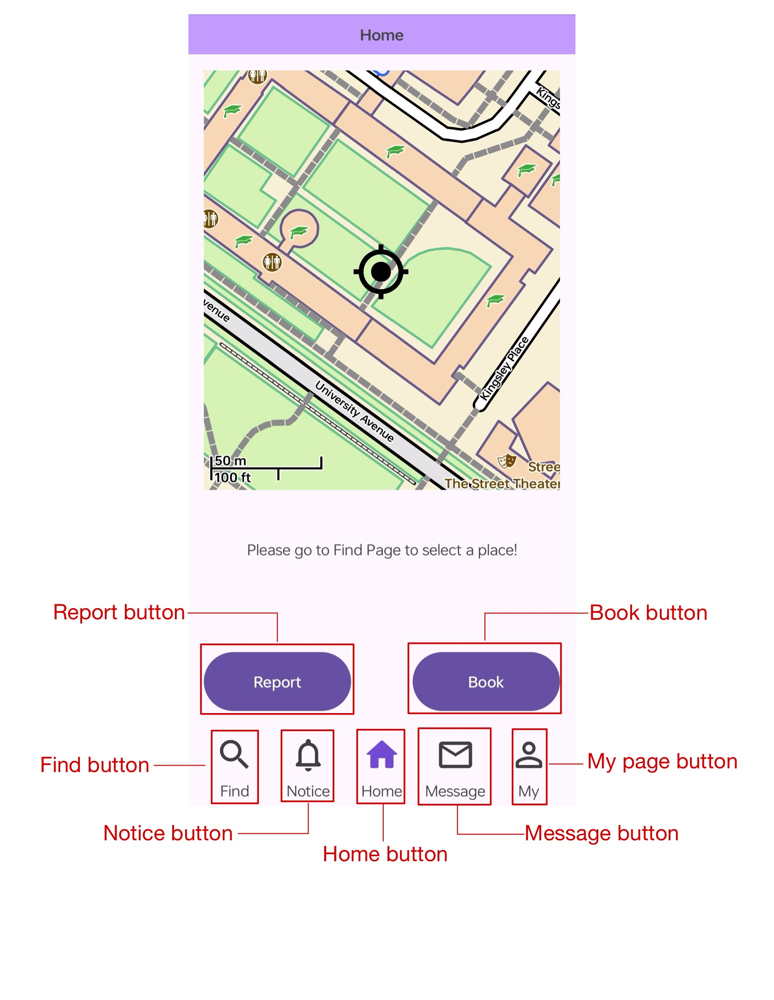
**Upon arriving in South Oval, the user finds out a maintenance issue with the oval and wants to report it to authority**
1. The user opens the application and clicks on the find page
2. The user looks through the list of outdoor venues and clicks on **South Oval**
3. The application automatically jumps to the homepage, with the map automatically showing **South Oval** and an icon of a playground on the map
4. The user clicks `Report` button
5. The Report page pops up, and the user enter the information to report
6. The report information, including the location is sent to Firebase server
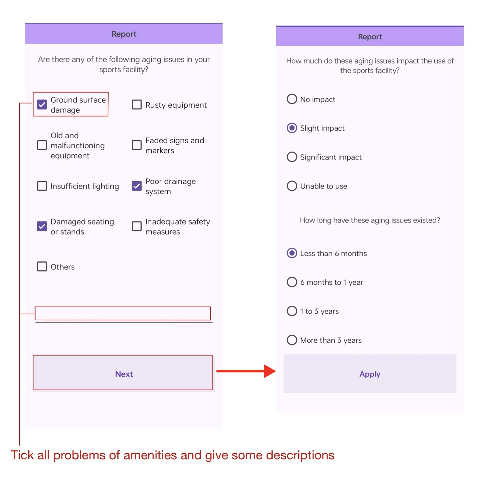

**People living in this smart city could use SmartCity as a social media, just like Messenger or Instagram, in which they could message each other**

A user wants to add a friend and chat with this person privately
1. The user navigates to **Message** page and clicks the icon on the right-top corner
2. The user enters the target person's username or email and clicks **Show result**
3. The user clicks on this person's account in the listview, a window pops up and asks `Are yopu sure to add this friend?`, and clicks yes. 
4. The other user approves the friend request and then they could start chatting with each other, by clicking the conversation in the **Message** page
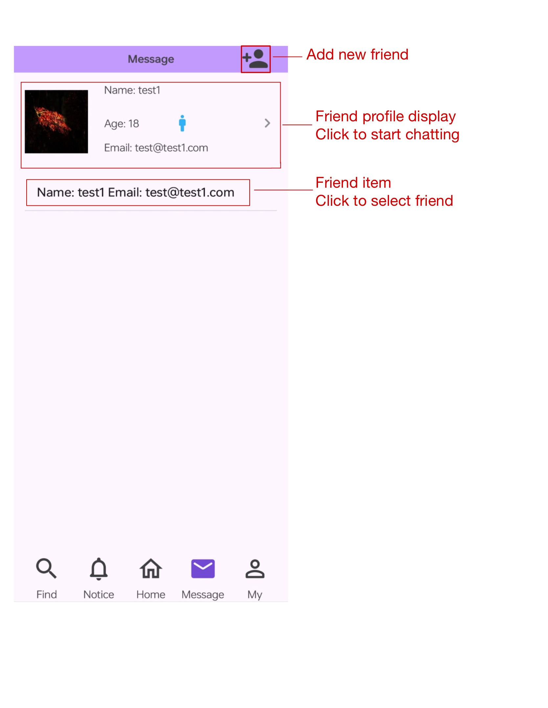

The other receives a friend request
1. The user navigates to **My** page and clicks the **Friend Request**, in the **Friend Request** page
2. The user could see the information displayed regarding the account who sent the request, including `age`, `gender`, `username`, `avatar` and `email`.
3. The user could either **Reject** or **Accept**
4. If the user chooses to accept, then they could start peer-to-peer messaging
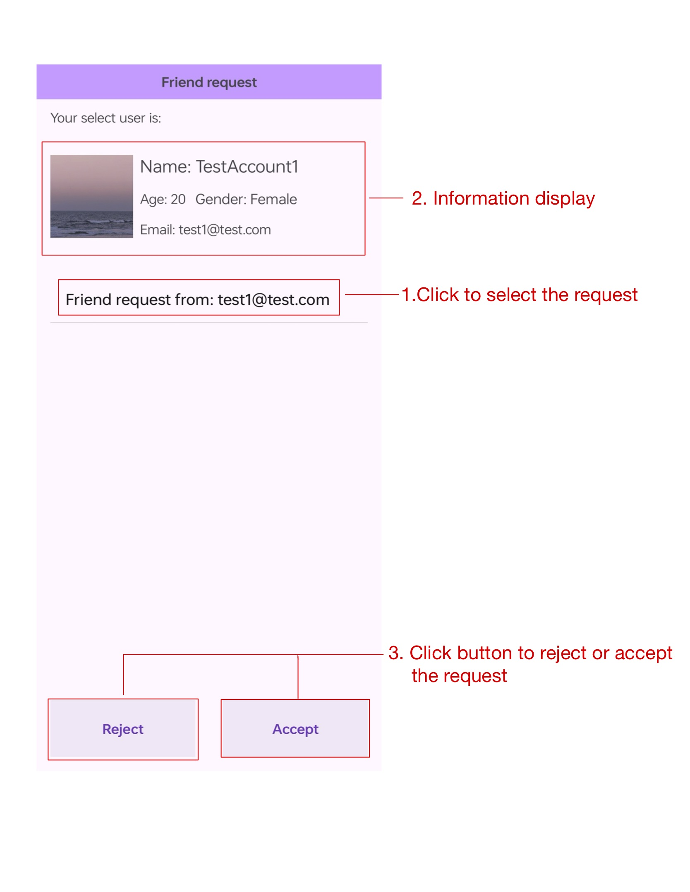

When you no longer feel comfortable with the person you're chatting with
1. First navigate to the conversation page via `Message -> This person` and click on the button on the right-top corner.
2. You'll see a pop-up window with three choices
  1. Block the user
  2. Delete the user
  3. Block this user and this user can not find you by searching forever
3. You could choose from any of these options, and you can turn off the option anytime you feel comfortable with messaging this person again.
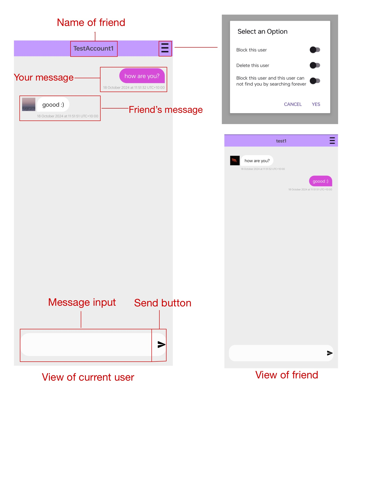
<hr> 

### Application UML

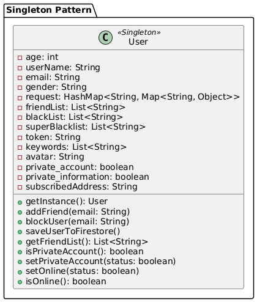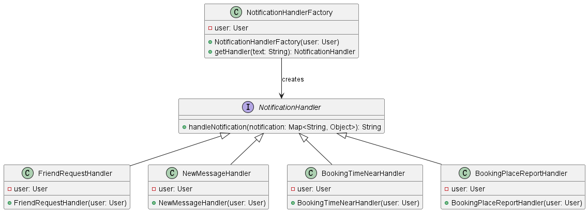
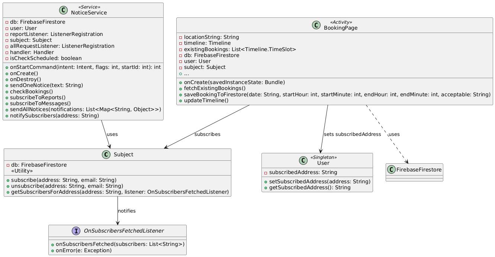
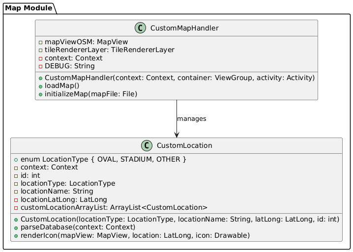
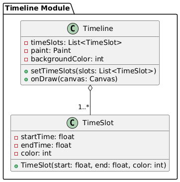
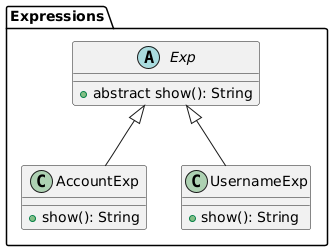
<hr>

## Code Design and Decisions
**Singleton classes**
- At first I implemented the renders, datahandler and imageloader all in the CustomLocation method, as static methods, which made the class very messy and huge. I've been advised to implement them as Singleton classes following the principle that each class should have exactly one responsibility, and I decided to do so.
I seperated them into several independent singleton classes with non-static methods, and initialize all of them in the CustomMapHandler class, which is also a singleton class. And the CustomLocation class is a dedicated class to create objects for the locations in Canberra, which you could see in the `FindPage`.

<hr>

### Data Structures

*[What data structures did your team utilise? Where and why?]*

Here is a partial (short) example for the subsection `Data Structures`:*

*I used the following data structures in my project:*

1. *Map (HashMap Implementation)*
   * *Objective: Used for storing user data and booking details efficiently for Firestore storage.*
   * *Code Locations: defined in [Class User, Methods saveUserToFirestore, Line From 244 to 282](https://gitlab.cecs.anu.edu.au/u7782042/gp-24s2/-/blob/main/androidProgram/app/src/main/java/com/example/smartcity/tools/User.java#L244-282) and [Class BookingPage, Method saveBookingToFirestore, Lines From 279 to 305](https://gitlab.cecs.anu.edu.au/u7782042/gp-24s2/-/blob/main/androidProgram/app/src/main/java/com/example/smartcity/BookingPage.java#L279-305); 
   * *Reasons:*
      * *HashMap provides O(1) average time complexity for insertions and lookups, making it ideal for managing user and booking data.*
      * *It allows for storing various types of user attributes such as username, email, age, and settings without predefined structure, adapting to dynamic changes.*
      * It is used along with SetOptions.merge() to prevent overwriting existing data while updating.
      * The key-value structure ensures easy access to individual elements (e.g., “keywords”, “is_online”), especially when interacting with Firestore collections.

2. *Arraylist*
    * *Objective: used for storing the list of locations (ovals and stadiums).*
    * *Code Locations: defined in [/tools/mapsforge/DataHandler, public static final ArrayList<CustomLocation> customLocationArrayList](https://gitlab.cecs.anu.edu.au/u7782042/gp-24s2/-/blob/main/androidProgram/app/src/main/java/com/example/smartcity/tools/mapsforge/DataHandler.java?ref_type=heads)
    * *Reasons:*
      * *Simple and fast to implement for short list (less than 100 items) of location objects.*
      * *No further implementation needed to be ready for iteration for location searching function*

3. *AVLtree*
   * *Objective: used for storing the contacts and deleting.*
   * *Code Locations: defined in [AVLTree.java](https://gitlab.cecs.anu.edu.au/u7782042/gp-24s2/-/blob/main/androidProgram/app/src/main/java/com/example/smartcity/tree/AVLTree.java?ref_type=heads)
   * *Reasons:*
       * *It has the same complexity in inserting and deleting element as using Arraylist but more efficient in searching element*
       * *Show we have the ability to use this hard data structure*

<hr>

### Design Patterns

1. **Factory**
   * *Objective*: Used for creating appropriate `NotificationHandler` instances based on the notification type.
   * *Code Locations*: Defined in `NotificationHandlerFactory.java`, [constructor and getHandler](https://gitlab.cecs.anu.edu.au/u7782042/gp-24s2/-/blob/main/androidProgram/app/src/main/java/com/example/smartcity/notifications/NotificationHandlerFactory.java) and [notifacitons](https://gitlab.cecs.anu.edu.au/u7782042/gp-24s2/-/blob/main/androidProgram/app/src/main/java/com/example/smartcity/notifications); called in [NoticePage](https://gitlab.cecs.anu.edu.au/u7782042/gp-24s2/-/blob/main/androidProgram/app/src/main/java/com/example/smartcity/NoticePage.java#L126-139)
   * *Reasons*:
      * **Centralized Creation**: Simplifies the management of different notification handlers, making the system easier to extend.
      * **Open/Closed Principle**: Supports adding new notification types without changing existing code.
      * **Consistency**: Ensures uniform instantiation of notification handlers.

2. **Singleton**
   * *Objective*: Manages a single instance of the `User` class for handling user data and settings.
   * *Objective*: Centralizes all four other custom map-related singleton classes and handles them together, which improves efficiency and simplifies the implementation of codes. By initializing the instance of CustomMapHandler, the instances of  `DataHandler`,`ImageLoader`,`Renderer`,`GPS` would be created automatically as well. And all the required parameter of  `DataHandler`,`ImageLoader`,`Renderer`,`GPS`would also be passed to correctly. 
   * *Code Locations*: 
     * Defined in `User.java`, [getInstance](https://gitlab.cecs.anu.edu.au/u7782042/gp-24s2/-/blob/main/androidProgram/app/src/main/java/com/example/smartcity/tools/User.java#L115-216).
     * Defined in `tools/mapsforge/CustomMapHandler`,[CustomMapHandler](https://gitlab.cecs.anu.edu.au/u7782042/gp-24s2/-/blob/main/androidProgram/app/src/main/java/com/example/smartcity/tools/mapsforge/CustomMapHandler.java?ref_type=heads)
     * Defined in `tools/mapsforge/Renderer`,[Renderer](https://gitlab.cecs.anu.edu.au/u7782042/gp-24s2/-/blob/main/androidProgram/app/src/main/java/com/example/smartcity/tools/mapsforge/Renderer.java?ref_type=heads)
     * Defined in `tools/mapsforge/DataHandler`, [DataHandler](https://gitlab.cecs.anu.edu.au/u7782042/gp-24s2/-/blob/main/androidProgram/app/src/main/java/com/example/smartcity/tools/mapsforge/DataHandler.java?ref_type=heads)
     * Defined in `tools/mapsforge/ImageLoader`, [ImageLoader](https://gitlab.cecs.anu.edu.au/u7782042/gp-24s2/-/blob/main/androidProgram/app/src/main/java/com/example/smartcity/tools/mapsforge/ImageLoader.java?ref_type=heads)
     * Defined in `tools/mapsforge/GPS`, [GPS](https://gitlab.cecs.anu.edu.au/u7782042/gp-24s2/-/blob/main/androidProgram/app/src/main/java/com/example/smartcity/tools/mapsforge/GPS.java?ref_type=heads)
   * *Reasons*:
      * **Single Source of Truth**: Guarantees consistent access to user data across the app.
      * **Maintenance and Extension Friendly**: Singleton classes are very simple and clear. They're easy to understand for future maintainers and ready for extension for future developers.
      * **Efficient Resource Use**: Prevents unnecessary memory usage by limiting the creation of multiple instances.
      * **Simplified Access**: Makes user data readily accessible from any part of the application.
      * **Secure initialization**: Non-static methods would only be accessible after creating an instance of the singleton class via its constructor, after which the necessary parameters must have been given correctly. 

3. **Observer**
   * *Objective*: Allows components to react to specific events, like when a new report is submitted for a booking place.
   * *Code Locations*: 
      * Subscription handled in `BookingPage.java`,[Firebase upload section](https://gitlab.cecs.anu.edu.au/u7782042/gp-24s2/-/blob/main/androidProgram/app/src/main/java/com/example/smartcity/BookingPage.java#L133-135).
      * Notifications managed in [`NoticeService.java`, booking report handling](https://gitlab.cecs.anu.edu.au/u7782042/gp-24s2/-/blob/main/androidProgram/app/src/main/java/com/example/smartcity/tools/NoticeService.java#L67-141).
      * Subject defined in [`Subject.java`](https://gitlab.cecs.anu.edu.au/u7782042/gp-24s2/-/blob/main/androidProgram/app/src/main/java/com/example/smartcity/tools/Subject.java).
   * *Reasons*:
      * **Event-Driven Updates**: Enables reactive communication without tightly coupling different system components.
      * **Streamlined for Single Use Case**: Since only one type of notification is needed, the design avoids unnecessary complexity.
      * **Embedded Logic**: The pattern is integrated within existing classes for simplicity, aligning with current application requirements.

   * *Trade-Offs*:
      * **Limited Extensibility**: Embedding the pattern restricts adding new observers easily.
      * **Complex Maintenance**: Mixed subscription and notification logic can make future updates more challenging.


<hr>

### Parser

### grammars

**Production Rules:**
```
    <finalExp> ::= <string> | <string> <semicolon> <finalExp>
    <string> ::= <username> | <account>
    <semicolon> ::= ";"
    <username> ::= <username>
    <account> ::= <account>
```
**How do I design the grammar?**
*At first I know that if we want to add a new friend, the way we can search is theirs username and account(email).*
*So we have 2 types tokens at the beginning.*
*One is "USERNAME" and the other is "ACCOUNT".*
*The way I differentiate between a username and an account number is: determining whether the given string contains “@” or not*
*Because of tokenizer has a function: .hasNext(), I started to think if I can search several users in a time.*
*So I add semicolon to separate one input from the other.*
*And add "SEMICOLON" as a new type in token.*
*And input can not end with ";" or start with ";"(it has limited in findNewFriend.java)*
*so this is how* ```<finalExp> ::= <string> | <string> <semicolon> <finalExp>```*constructed*
*which do not contain:*```<finalExp> ::= <string> <semicolon>```
*Also in changing user name part, I do not allow user name contains ";" and "@".*

**The advantages of my designs**
  - **Modularity:**
    *By separating components like string, username, and account, the grammar is modular.*
    *This allows for reusing these components across other expressions or expanding them with additional functionality in the future.*

  - **Flexibility:**
    *The grammar allows for chained expressions (<string> <semicolon> <finalExp>).*
    *it can parse one or more entries, which could be useful for handling lists of usernames or accounts in a query.*


  - **Extensibility:**
    *The current design can be easily extended.*
    *For example, if you want to add gender tag ("Male"|"Female") to implement filter in custom feature, the grammar could be:*
```
  
    <finalExp> ::= <input> | <input> <semicolon> <finalExp>
    <input> ::= <string> | <string> <comma> <tag>
    <string> ::= <username> | <account>
    <semicolon> ::= ";"
    <comma> ::= ","
    <username> ::= <username>
    <account> ::= <account>
    <tag> ::= <male> | <female>
    <male> ::= "Male"
    <female> ::= "Female"
```
    


**Advantages for semicolon**
*1.Clear Separator:*
*The semicolon acts as a clear separator between different expressions or elements. (compare to " ")*
*This makes it easier for the parser to distinguish between multiple inputs and preventing any ambiguity.*
*2.Reduced Conflict's likelihood:*
*Usernames and accounts rarely use semicolons.*
*It reduces the likelihood of parsing mistakes.*


### tokenizers-and-parsers

**Where do you use tokenisers and parsers?**
*in message page if you click the icon in the upper right corner then you can go to find friend page*
*After you enter input in that EditText view and click the search icon, the tokeniser (in out programme it is "tokenizer") and parser will seart to work.*

**How are they built?**

*Firstly our input will be executed by our Tokenizer*

*if String input do not contains ";"*
*it will be considered as one user's information*
*else*
*It will separate the user information inside this string by a semicolon / semicolons first*

*And token class will give each token a type:*
*";" is SEMICOLON*
*string contains "@" is ACCOUNT*
*else is USERNAME*

*After that*
*parse() will start and it will return finalExp()*

*If the input do not contain ";"*
*in finalExp we will get 1 token which type is String*
*and use string() to distinguish the input is USERNAME or ACCOUNT*
*then use FinalExp(strExp) to construct parser tree*

*else*
*in finalExp we will get a token and judge its type: ACCOUNT or USERNAME or SEMICOLON*
*and use string to distinguish the input is USERNAME or ACCOUNT*
*it will use .eat() in string() to move to semicolon, and use .eat() in .semicolon() again to move to next FinalExp*
*then use FinalExp(strExp, semicolonExp, nextFinalExp) to construct parser tree*

*After a series of recursions, we get a parser tree based on our parser grammar and then we can execute each USERNAME or ACCOUNT by Firestore's query.*

#### the-advantages-of-the-designs

*1.Extensibility*
*If the grammar of parser changed, then our Exps and parser can also change easily.*
*2.Universality*
*For .eat(), it can move to next token, and it is accepted by all token types*
*3.Modularization*
*During the development if we find bugs we can change only one class and its related functions*
    
    

<hr>

### Others

**Data file design**
  - Data format and structure:
  - Firestore is chosen as the data store, and JSON-like document structure is used to categorize and manage the data by collections (e.g. users, bookings, reports).
  - Each data entry represents key information in the application (e.g., user profile, bookings, reports) and contains fields such as email, username, friend_list, etc. The Firestore is used as the data store.
  - Reasons for choosing Firestore:
  1. Provides real-time synchronization and scalable storage in the cloud. 2.
  2. cross-platform compatibility, can be accessed on mobile and Web. 3. support for structured data storage.
  3. supports structured data storage, which is suitable for application requirements. 4.
  4. Integration with Firebase authentication simplifies user management.
  - Data set creation:
  - Generated 2500 valid entries using the UserGenerator class. Simulated user data is automatically uploaded to the Firestore to ensure that the amount of data required for the course is met.
  - Links to the database or GitLab repository are provided in the report, and editing permissions were given to comp21006442@gmail.com.

**UI test design**
- Testing Framework Selection:
- Use Espresso for UI testing to ensure that interactive elements in the application work properly.
- Espresso supports synchronized ViewActions (e.g., clicks and text input) to ensure a stable testing process.
- UI test coverage:
- Testing simulates user interactions and ensures that key UI elements (e.g., buttons, input boxes, forms) respond correctly.
- Navigation Tests Verify that jumps between pages function properly, such as between login, registration, and the home page.
- Forms Testing Ensure that input boxes are typing properly and that on/off buttons are toggling states.
- Lifecycle management:
- Use ActivityScenario to ensure that activities in each test case are started and shut down correctly.
- Implement a custom IdlingResource to handle asynchronous tasks (e.g. Firebase operations) to ensure the stability of the test flow.
- Permission handling:
- Use GrantPermissionRule to handle network, location, and storage permissions for tests to avoid permission pop-ups.

**Challenge Solving:**
- Implement custom ViewActions to manipulate complex UI elements (e.g., setting the time picker).
- Use Mock to simulate user login states to ensure repeatable tests with consistent results.

**Map design**
- The custom map is built from scratch which means that I need to mannualy implement classes from front-end UI in the `Homepage` (and support for landscape view) to map's renderer, to handling the IO stream of `.map` files.
- They are: `DataHandler`,`ImageLoader`,`Renderer`,`GPS`. They respectively handles (and parses) data (.csv), loads images, renders the map and handles GPS service (although feature implementation is incomplete).
- They're are initialized automatically by initializing the `CustomMapHandler`, which is also a singleton class to which these map-related classes chained.
- It was a headache to pass the `context` parameter from back-end to front-end, but with the implementation of the `CustomMapHandler` class, developer would only to pass the `Context` parameter once while creating the instance of it, and the parameter would to passed onto all other relative instances.
<br>
<hr>

## Implemented Features
*[What features have you implemented? where, how, and why?]* <br>
*List all features you have completed in their separate categories with their featureId. THe features must be one of the basic/custom features, or an approved feature from Voice Four Feature.*

### Basic Features
1. [LogIn]. The app must support user login functionality. (easy)
   * Code: [Class LogIn, whole class](https://gitlab.cecs.anu.edu.au/u7782042/gp-24s2/-/blob/main/androidProgram/app/src/main/java/com/example/smartcity/LogIn.java?ref_type=heads)
   * [Class SignUp, whole class](https://gitlab.cecs.anu.edu.au/u7782042/gp-24s2/-/blob/main/androidProgram/app/src/main/java/com/example/smartcity/SignUp.java?ref_type=heads)
   * [Class Start, whole class](https://gitlab.cecs.anu.edu.au/u7782042/gp-24s2/-/blob/main/androidProgram/app/src/main/java/com/example/smartcity/Start.java?ref_type=heads)
   * [Class Util, from line 25 to 59](https://gitlab.cecs.anu.edu.au/u7782042/gp-24s2/-/blob/main/androidProgram/app/src/main/java/com/example/smartcity/tools/Util.java?ref_type=heads#L25-59)
   * Description: 
     * Login function is implemented with firebase, which means user can login their account on different devices and share the same information.
     * The app starts at Start page where user can choose to login or sign up a account.
     * login activity and sign up activity are connect and transit by pressing "already have an account?" and"do not have an account"
     * password reset is implemented at login page-- user should input their account(Email) first and will receive a verification email
     * In order to improve account safety, when user sign up the account, the app will ensure the email is valid and password should follows series of rules(shown in report image2)
     * The original test-account credentials have been removed from this public repository.

2. [UIFeedback]. The UI must provide clear and informative feedback for user actions, including error messages to guide users effectively.
    * Description:
      * Users will receive an relevant error message(depends on which rule the input broke) if they attempt to sign up with an invalid email or password.
      * Users will receive an error message if they enter the wrong password when logging in.
      * Every action that triggers a result will display the outcome to the user, ensuring clear and immediate feedback.

3. [UXUI]. The app must maintain a consistent design language throughout, including colors, fonts, and UI element styles, to provide a cohesive user experience. The app must also handle orientation changes (portrait to landscape and vice versa) gracefully, ensuring that the layout adjusts appropriately. (easy)
    * Description:
      * Using dark purple as the theme color.
      * All key UI elements are in round style.
      * Every activity have different orientations layout(manifest in contribution of Daoyan Zhu and Shangyi Shen) to better adjust different screen and improve user's using experience.

4. [LoadShowData]. The app loads `.csv` files stored locally in the `assets` directory and displays the `.csv` file as a list of locations in the `FindPage`.
    * Code: 
      * `initializeDatabase` method in tools/mapsforge/DataHandler`, [DataHandler](https://gitlab.cecs.anu.edu.au/u7782042/gp-24s2/-/blob/main/androidProgram/app/src/main/java/com/example/smartcity/tools/mapsforge/DataHandler.java?ref_type=heads)
    * Description:
      * `InitializeDatabase` reads the `.csv` file from `assets` folder and parses each line (except the first line) with `bufferedReader`, creates `CustomLocation` instances for each location and stores them in the `customLocationArrayList` for future usage (such as iteration-based indexing).

5. [DataFiles]. The app must use a data set (which you may create) where each entry represents a meaningful piece of information relevant to the app. The data set must be represented and stored in a structured format as taught in the course. It must contain at least 2,500 valid instances. (easy)
    * Code:
        * [User.java, from line 244 to 429](https://gitlab.cecs.anu.edu.au/u7782042/gp-24s2/-/blob/main/androidProgram/app/src/main/java/com/example/smartcity/tools/User.java#L244-429)
        * [BookingPage.java from line 279 to 305](https://gitlab.cecs.anu.edu.au/u7782042/gp-24s2/-/blob/main/androidProgram/app/src/main/java/com/example/smartcity/BookingPage.java#L279-305)
        * [Report1.java from line 45 to 100](https://gitlab.cecs.anu.edu.au/u7782042/gp-24s2/-/blob/main/androidProgram/app/src/main/java/com/example/smartcity/Report1.java#L45-100)
        * [Report2.java from line 50 to 107](https://gitlab.cecs.anu.edu.au/u7782042/gp-24s2/-/blob/main/androidProgram/app/src/main/java/com/example/smartcity/Report2.java#L50-107)
        * [UserGenerator.java](https://gitlab.cecs.anu.edu.au/u7782042/gp-24s2/-/blob/main/androidProgram/app/src/main/java/com/example/smartcity/tools/UserGenerator.java)
    * Description:
        * Link to the Firebase repo:  https://console.firebase.google.com/u/0/project/groupwork-c2a12/firestore/databases/-default-/data
        * Editor access has been granted to comp21006442@gmail.com
        * User data, bookings, and reports are stored in Firestore with real-time updates for online status and privacy settings.
        * Automated user generation is implemented for testing, including friend lists and blacklists for each user.

6. [Search]. The app must allow users to search for information. Based on the user's input, adhering to pre-defined grammar(s), a query processor must interpret the input and retrieve relevant information matching the user's query. The implementation of this functionality should align with the app’s theme. The application must incorporate a **tokenizer and parser** utilizing a formal grammar created specifically for this purpose. (medium)
   * Code :
     *  class `TokenForFindFriend.java`:[TokenForFindFriend.java](https://gitlab.cecs.anu.edu.au/u7782042/gp-24s2/-/blob/main/androidProgram/app/src/main/java/com/example/smartcity/tools/tokenTokenizer/TokenForFindFriend.java?ref_type=heads)
     *  class `TokenizerForFindFriend.java`:[TokenizerForFindFriend.java](https://gitlab.cecs.anu.edu.au/u7782042/gp-24s2/-/blob/main/androidProgram/app/src/main/java/com/example/smartcity/tools/tokenTokenizer/TokenizerForFindFriend.java?ref_type=heads)
     *  class `Exp.java`:[Exp.java](https://gitlab.cecs.anu.edu.au/u7782042/gp-24s2/-/blob/main/androidProgram/app/src/main/java/com/example/smartcity/tools/expParser/Exp.java?ref_type=heads)
     *  class `FinalExp.java`:[FinalExp.java](https://gitlab.cecs.anu.edu.au/u7782042/gp-24s2/-/blob/main/androidProgram/app/src/main/java/com/example/smartcity/tools/expParser/FinalExp.java?ref_type=heads)
     *  class `StringExp.java`:[StringExp.java](https://gitlab.cecs.anu.edu.au/u7782042/gp-24s2/-/blob/main/androidProgram/app/src/main/java/com/example/smartcity/tools/expParser/StringExp.java?ref_type=heads)
     *  class `SemicolonExp.java`:[SemicolonExp.java](https://gitlab.cecs.anu.edu.au/u7782042/gp-24s2/-/blob/main/androidProgram/app/src/main/java/com/example/smartcity/tools/expParser/SemicolonExp.java?ref_type=heads)
     *  class `AccountExp.java`:[AccountExp.java](https://gitlab.cecs.anu.edu.au/u7782042/gp-24s2/-/blob/main/androidProgram/app/src/main/java/com/example/smartcity/tools/expParser/AccountExp.java?ref_type=heads)
     *  class `UsernameExp.java`:[UsernameExp.java](https://gitlab.cecs.anu.edu.au/u7782042/gp-24s2/-/blob/main/androidProgram/app/src/main/java/com/example/smartcity/tools/expParser/UsernameExp.java?ref_type=heads)
     *  class `ParserForFindFriend.java`:[ParserForFindFriend.java](https://gitlab.cecs.anu.edu.au/u7782042/gp-24s2/-/blob/main/androidProgram/app/src/main/java/com/example/smartcity/tools/expParser/ParserForFindFriend.java?ref_type=heads)
     *  class `SearchExe.java`:[SearchExe.java](https://gitlab.cecs.anu.edu.au/u7782042/gp-24s2/-/blob/main/androidProgram/app/src/main/java/com/example/smartcity/tools/expParser/SearchExe.java?ref_type=heads)
     *  Search new friend:[FindNewFriend.java](https://gitlab.cecs.anu.edu.au/u7782042/gp-24s2/-/blob/main/androidProgram/app/src/main/java/com/example/smartcity/FindNewFriend.java?ref_type=heads#L92-139)
     *  Show search result:[FindNewFriend.java](https://gitlab.cecs.anu.edu.au/u7782042/gp-24s2/-/blob/main/androidProgram/app/src/main/java/com/example/smartcity/FindNewFriend.java?ref_type=heads#L141-185)
     *  select age range and gender:[FindNewFriend.java](https://gitlab.cecs.anu.edu.au/u7782042/gp-24s2/-/blob/main/androidProgram/app/src/main/java/com/example/smartcity/FindNewFriend.java?ref_type=heads#L223-300)
   * Description:
     * use tokenizer and parser to execute user’s input when they want to find one or more new friends.(for more token/tokenizer/parser/Exp information please see ###Parser)
     * if users input can not find anything by searching username or email,it will start to search keywords of their username and email
     * user’s input can not be empty or start with “;” or end with “;”
     * if users do not change their input, they can only click search icon 1 time, once users click “Show result” button, then they can click search icon again
     * if user change their input after they click search icon, in this situation, they can click twice.

7. [DataStream]
- code: Below is the list of main classes in the `notifications` folder, the `NoticeService` and `Subject` classes in the `tools` folder, and the `NoticePage` class:
    - [BookingPlaceReportHandler.java](https://gitlab.cecs.anu.edu.au/u7782042/gp-24s2/-/blob/main/androidProgram/app/src/main/java/com/example/smartcity/notifications/BookingPlaceReportHandler.java)
    - [BookingTimeNearHandler.java](https://gitlab.cecs.anu.edu.au/u7782042/gp-24s2/-/blob/main/androidProgram/app/src/main/java/com/example/smartcity/notifications/BookingTimeNearHandler.java)
    - [FriendRequestHandler.java](https://gitlab.cecs.anu.edu.au/u7782042/gp-24s2/-/blob/main/androidProgram/app/src/main/java/com/example/smartcity/notifications/FriendRequestHandler.java)
    - [NewMessageHandler.java](https://gitlab.cecs.anu.edu.au/u7782042/gp-24s2/-/blob/main/androidProgram/app/src/main/java/com/example/smartcity/notifications/NewMessageHandler.java)
    - [NoticeService.java](https://gitlab.cecs.anu.edu.au/u7782042/gp-24s2/-/blob/main/androidProgram/app/src/main/java/com/example/smartcity/tools/NoticeService.java)
    - [Subject.java](https://gitlab.cecs.anu.edu.au/u7782042/gp-24s2/-/blob/main/androidProgram/app/src/main/java/com/example/smartcity/tools/Subject.java)
    - [NoticePage.java](https://gitlab.cecs.anu.edu.au/u7782042/gp-24s2/-/blob/main/androidProgram/app/src/main/java/com/example/smartcity/NoticePage.java)
    - [NotificationHandlerFactory.java](https://gitlab.cecs.anu.edu.au/u7782042/gp-24s2/-/blob/main/androidProgram/app/src/main/java/com/example/smartcity/notifications/NotificationHandlerFactory.java)
    - [NotificationHandler.java](https://gitlab.cecs.anu.edu.au/u7782042/gp-24s2/-/blob/main/androidProgram/app/src/main/java/com/example/smartcity/notifications/NotificationHandler.java)
- Overview of Notification Datastream
    - Our application primarily utilizes the Observer Pattern and periodic update mechanisms, ensuring that data is automatically loaded and regularly updated when a user is logged in or enters a specific activity, thereby enabling automatic updates within the app.
- Listening for Report Changes
    - In the [listenForReports()](https://gitlab.cecs.anu.edu.au/u7782042/gp-24s2/-/blob/main/androidProgram/app/src/main/java/com/example/smartcity/tools/NoticeService.java#L67-92) method, `NoticeService` listens to real-time changes in the `"reports"` collection using FirebaseFirestore's `addSnapshotListener`.
    - When a new report is added or modified, `NoticeService` calls the [notifySubscribers(address)](https://gitlab.cecs.anu.edu.au/u7782042/gp-24s2/-/blob/main/androidProgram/app/src/main/java/com/example/smartcity/tools/NoticeService.java#L99-114) method, utilizing the `Subject` class to notify all subscribers.
- Listening for All Notifications
    - Through the [listenForAllNotices()](https://gitlab.cecs.anu.edu.au/u7782042/gp-24s2/-/blob/main/androidProgram/app/src/main/java/com/example/smartcity/tools/NoticeService.java#L266-290) method, `NoticeService` listens to the current user's `"notifications"` document. When new notifications are added, it triggers the [sendAllNotices(notifications)](https://gitlab.cecs.anu.edu.au/u7782042/gp-24s2/-/blob/main/androidProgram/app/src/main/java/com/example/smartcity/tools/NoticeService.java#L346-388)method to process and display notifications.
- Periodic Update Mechanism
    - In the [onStartCommand()](https://gitlab.cecs.anu.edu.au/u7782042/gp-24s2/-/blob/main/androidProgram/app/src/main/java/com/example/smartcity/tools/NoticeService.java#L60-65) method, `NoticeService` invokes the `schedulePeriodicCheck()` method, which uses a `Handler` to execute the `checkBookings()` method at regular intervals (e.g., every hour).
    - The [checkBookings()](https://gitlab.cecs.anu.edu.au/u7782042/gp-24s2/-/blob/main/androidProgram/app/src/main/java/com/example/smartcity/tools/NoticeService.java#L165-186) method examines the user's booking information. If a booking time is approaching and a notification has not yet been sent, it calls the [BookingNearNotification(address)](https://gitlab.cecs.anu.edu.au/u7782042/gp-24s2/-/blob/main/androidProgram/app/src/main/java/com/example/smartcity/tools/NoticeService.java#L193-215)method to send the notification and updates the booking's notification status.
- NotificationHandler Interface and Its Implementations
    - The `NotificationHandler` interface defines the `handleNotification` method. Specific implementation classes (such as [BookingPlaceReportHandler.java](https://gitlab.cecs.anu.edu.au/u7782042/gp-24s2/-/blob/main/androidProgram/app/src/main/java/com/example/smartcity/notifications/BookingPlaceReportHandler.java), [BookingTimeNearHandler.java](https://gitlab.cecs.anu.edu.au/u7782042/gp-24s2/-/blob/main/androidProgram/app/src/main/java/com/example/smartcity/notifications/BookingTimeNearHandler.java), [FriendRequestHandler.java](https://gitlab.cecs.anu.edu.au/u7782042/gp-24s2/-/blob/main/androidProgram/app/src/main/java/com/example/smartcity/notifications/FriendRequestHandler.java), [NewMessageHandler.java](https://gitlab.cecs.anu.edu.au/u7782042/gp-24s2/-/blob/main/androidProgram/app/src/main/java/com/example/smartcity/notifications/NewMessageHandler.java)) implement specific logic to process and format notifications based on their types.
    - These handler classes are instantiated in the [NotificationHandlerFactory.java](https://gitlab.cecs.anu.edu.au/u7782042/gp-24s2/-/blob/main/androidProgram/app/src/main/java/com/example/smartcity/notifications/NotificationHandlerFactory.java) based on the `"text"` field of the notification, ensuring that different types of notifications are correctly processed.
- Displaying Notifications
    - The [NoticePage.java](https://gitlab.cecs.anu.edu.au/u7782042/gp-24s2/-/blob/main/androidProgram/app/src/main/java/com/example/smartcity/NoticePage.java) uses the [updateListView()](https://gitlab.cecs.anu.edu.au/u7782042/gp-24s2/-/blob/main/androidProgram/app/src/main/java/com/example/smartcity/NoticePage.java#L128-141) method to retrieve the appropriate handler from the `NotificationHandlerFactory`, format the notification messages, and display them in a `ListView`.
- App Launch and Activity Transition
    - When a user logs in or enters a specific activity (such as `NoticePage` or `MyPage`), relevant listeners (like those in [NoticeService.java](https://gitlab.cecs.anu.edu.au/u7782042/gp-24s2/-/blob/main/androidProgram/app/src/main/java/com/example/smartcity/tools/NoticeService.java)) are activated to ensure that data is loaded and updated in real-time through data streams (e.g., Firebase Firestore's Snapshot Listeners).
    - The periodic check mechanism (e.g., in `BookingTimeNearHandler`) ensures that booking information is regularly reviewed and updated, maintaining the timeliness and accuracy of notifications.
       <br>


### Custom Features
Feature Category: Greater Data Usage, Handling and Sophistication <br>
1. `[Data-format]`. The app must read data from local files in at least two different formats, such as JSON, XML, etc.
    * Code:
        * `loadMap`and `initializeMap` methods in `tools/mapsforge/CustomMapHandler`,[CustomMapHandler](https://gitlab.cecs.anu.edu.au/u7782042/gp-24s2/-/blob/main/androidProgram/app/src/main/java/com/example/smartcity/tools/mapsforge/CustomMapHandler.java?ref_type=heads)
    * Description:
        * `.map` file is a binary file that's specially defined and optimized for vector maps from [OpenStreetMap](https://www.openstreetmap.org/) downloaded from [BBBike](https://extract.bbbike.org/), free and open-source. Vector maps with binary encoding are particularly effiency, allowing the storage of a megacity's complete map, including all small tracks, restaurants and shops within 10mp, while providing high-clarity at any zoom level. In comparison, a conventional tile map may use hundreds of megabytes to store the same city's map of different zoom levels, while still looking very unclear and low-resolution if set on a very high zoom level. Using `.map` file allows the user to access high-quality offline map of the whole city while keeping the application light-weight.
        * `loadMap` checks if there is already a map file in the external directory, if not, it would copy a `.map` file from the `assets` folder to external directory (storage). And `initializeMap` converts the `.map` file into a `MapFile` object of the open-source `Mapsforge` renderer library. It then renders the map from the `Mapfile` and adds it into the container, which is the front-end UI for the map in the `HomePage`.

Feature Category:Greater Data Usage, Handling and Sophistication<br>
2. `[Data-Graphical]`. The app must include a graphical report viewer that displays a report with useful data from the app. No marks will be awarded if the report is not graphical. (hard)
    * [Class GraphicalReport, entire file](https://gitlab.cecs.anu.edu.au/u7782042/gp-24s2/-/blob/main/androidProgram/app/src/main/java/com/example/smartcity/GraphicalReport.java)
    * [Bookingpage Line 314-373](https://gitlab.cecs.anu.edu.au/u7782042/gp-24s2/-/blob/main/androidProgram/app/src/main/java/com/example/smartcity/BookingPage.java#L314-374)
    * [Class Timeline, entire file](https://gitlab.cecs.anu.edu.au/u7782042/gp-24s2/-/blob/main/androidProgram/app/src/main/java/com/example/smartcity/tools/Timeline.java)
    * Both BookingPage and GraphicalReport leverage the Timeline component to deliver intuitive and informative graphical representations of reservation data:
        * The BookingPage integrates a graphical timeline to provide users with a comprehensive view of reservation statuses for a selected date. This visual representation facilitates easier booking management by clearly distinguishing between available and already booked time slots.
        * The GraphicalReport section employs the Timeline component to present a visual summary of reservation activities over the past seven days. This timeline aids in analyzing booking trends and understanding user engagement with subscription addresses.<br>

Feature Category:Peer to Peer Messaging<br>
3. `[P2P-DM]`. The app must provide users with the ability to send direct, private messages to each other. (hard)
    * Code References:
      - [Class P2PMessage](https://gitlab.cecs.anu.edu.au/u7782042/gp-24s2/-/blob/main/androidProgram/app/src/main/java/com/example/smartcity/P2PMessage.java?ref_type=heads)
      - [Class MessagePage](https://gitlab.cecs.anu.edu.au/u7782042/gp-24s2/-/blob/main/androidProgram/app/src/main/java/com/example/smartcity/MessagePage.java?ref_type=heads)
      - [Class Message](https://gitlab.cecs.anu.edu.au/u7782042/gp-24s2/-/blob/main/androidProgram/app/src/main/java/com/example/smartcity/tools/Message.java?ref_type=heads)
      - [Class MessageAdapter](https://gitlab.cecs.anu.edu.au/u7782042/gp-24s2/-/blob/main/androidProgram/app/src/main/java/com/example/smartcity/tools/MessageAdapter.java?ref_type=heads)

    * Description:
      - Users must be friends before they can start a conversation.
      - Users can choose to block a friend, preventing that friend from sending any further messages.
      - Users can delete friends from their friend list.
      - Messages are automatically arranged in chronological order based on the time they were sent, ensuring smooth conversation flow.

    **FAQ:**

    1. **How to Become Friends:**
       - Navigate to the *Message Page* and tap the "Add Friend" button at the top-right corner of the screen.
       - Enter the desired username in the search bar and tap the "Show Results" button.
       - Select the user from the displayed search results and send a friend request.
       - Once the recipient accepts the friend request via the *Friend Request* page, both users' friend lists will be updated in real time.

    2. **How to Start a Chat:**
       - Go to the *Message Page*.
       - Select a friend you want to chat with by tapping their name in the list of friends.
       - The friend's profile will appear at the top of the screen, and you can enter the P2P message screen by tapping their profile.

    3. **How to Block or Delete a Friend:**
       - Begin at the P2P message page.
       - Tap the settings button located at the top-right corner of the page.
       - From there, select the option to block or delete the friend as desired.

Feature Category: Privacy <br>
4. `[Privacy-block]`.  The app must provide content providers (or users) with the ability to block other users or specific contents/profiles. Once blocked, the user shall not be able to view the relevant contents in search results. (hard)
    * Code:
        * block or unblock users:[P2PMessage.java](https://gitlab.cecs.anu.edu.au/u7782042/gp-24s2/-/blob/main/androidProgram/app/src/main/java/com/example/smartcity/P2PMessage.java?ref_type=heads#L252-296)
        * If A is in B super black list(B use privacy-block to block A) when A search B's account:[AccountExp.java](https://gitlab.cecs.anu.edu.au/u7782042/gp-24s2/-/blob/main/androidProgram/app/src/main/java/com/example/smartcity/tools/expParser/AccountExp.java?ref_type=heads#L110-138)
        * If A is in B super black list(B use privacy-block to block A) when A search B's name:[UsernameExp.java](https://gitlab.cecs.anu.edu.au/u7782042/gp-24s2/-/blob/main/androidProgram/app/src/main/java/com/example/smartcity/tools/expParser/UsernameExp.java?ref_type=heads#L103-132)
        * If A is in B super black list(B use privacy-block to block A) when A search B's keyword:[InvalidSearch.java](https://gitlab.cecs.anu.edu.au/u7782042/gp-24s2/-/blob/main/androidProgram/app/src/main/java/com/example/smartcity/tools/expParser/InvalidSearch.java?ref_type=heads#L82-109)
    * Description of your implementation:
        * people can only use privacy-block to block users in their friend list
        * once A use privacy-block to block B
        * B can not see A in B's contacts list
        * B can not see A in B's search result(in find new friend)

Feature Category: UI Design and Testing <br>
5. `[UI-Test]` The app must include comprehensive UI tests using Espresso (not covered in lectures/labs), ensuring reasonable quality and coverage of the app. *(hard)*

* [AccountSettingsTest](https://gitlab.cecs.anu.edu.au/u7782042/gp-24s2/-/blob/main/androidProgram/app/src/androidTest/java/com/example/smartcity/AccountSettingsTest.java)
* [BookingPageTest](https://gitlab.cecs.anu.edu.au/u7782042/gp-24s2/-/blob/main/androidProgram/app/src/androidTest/java/com/example/smartcity/BookingPageTest.java)
* [FindNewFriendTest](https://gitlab.cecs.anu.edu.au/u7782042/gp-24s2/-/blob/main/androidProgram/app/src/androidTest/java/com/example/smartcity/FindNewFriendTest.java)
* [FriendRequestTest](https://gitlab.cecs.anu.edu.au/u7782042/gp-24s2/-/blob/main/androidProgram/app/src/androidTest/java/com/example/smartcity/FriendRequestTest.java)
* [HomePageTest](https://gitlab.cecs.anu.edu.au/u7782042/gp-24s2/-/blob/main/androidProgram/app/src/androidTest/java/com/example/smartcity/HomePageTest.java)
* [LogInTest](https://gitlab.cecs.anu.edu.au/u7782042/gp-24s2/-/blob/main/androidProgram/app/src/androidTest/java/com/example/smartcity/LogInTest.java)
* [ManageBookingTest](https://gitlab.cecs.anu.edu.au/u7782042/gp-24s2/-/blob/main/androidProgram/app/src/androidTest/java/com/example/smartcity/ManageBookingTest.java)
* [MessagePageTest](https://gitlab.cecs.anu.edu.au/u7782042/gp-24s2/-/blob/main/androidProgram/app/src/androidTest/java/com/example/smartcity/MessagePageTest.java)
* [NoticePageTest](https://gitlab.cecs.anu.edu.au/u7782042/gp-24s2/-/blob/main/androidProgram/app/src/androidTest/java/com/example/smartcity/NoticePageTest.java)
* [NotificationSettingTest](https://gitlab.cecs.anu.edu.au/u7782042/gp-24s2/-/blob/main/androidProgram/app/src/androidTest/java/com/example/smartcity/NotificationSettingTest.java)
* [PasswordResetTest](https://gitlab.cecs.anu.edu.au/u7782042/gp-24s2/-/blob/main/androidProgram/app/src/androidTest/java/com/example/smartcity/PasswordResetTest.java)
* [Report1Test](https://gitlab.cecs.anu.edu.au/u7782042/gp-24s2/-/blob/main/androidProgram/app/src/androidTest/java/com/example/smartcity/Report1Test.java)
* [Report2Test](https://gitlab.cecs.anu.edu.au/u7782042/gp-24s2/-/blob/main/androidProgram/app/src/androidTest/java/com/example/smartcity/Report2Test.java)
* [SignUpTest](https://gitlab.cecs.anu.edu.au/u7782042/gp-24s2/-/blob/main/androidProgram/app/src/androidTest/java/com/example/smartcity/SignUpTest.java)
* [StartTest](https://gitlab.cecs.anu.edu.au/u7782042/gp-24s2/-/blob/main/androidProgram/app/src/androidTest/java/com/example/smartcity/StartTest.java)

* **User Simulation and Data Loading:** Simulated user login and ensured data was properly loaded before performing operations.
* **UI Element Verification:** Checked that essential elements, such as buttons, input fields, radio buttons, checkboxes, and time pickers, were correctly displayed.
* **Button and Page Navigation Testing:** Verified that buttons were functional and ensured correct navigation to target pages upon clicking.
* **Interaction Testing:** Tested text input in input fields, switch toggling, form submission, and operation confirmation.
* **Asynchronous Task Synchronization:** Managed asynchronous tasks using a custom IdlingResource and Handler to ensure stable test flows.
* **Mock Data Management:** Inserted and deleted mock data in certain tests to validate interaction outcomes.
* **Permission Management:** Handled necessary permissions for network, location, notifications, and storage during tests.
* **Lifecycle Management:** Ensured that activities in each test class were properly initialized and closed at the start and end of tests.
<hr>

### Surprise Feature

(i) [Commit 54d9d936 NoticePage.java](https://gitlab.cecs.anu.edu.au/u7782042/gp-24s2/-/blob/54d9d936/androidProgram/app/src/main/java/com/example/smartcity/NoticePage.java#L157-190) 
  
(ii) [Refactor NoticePage.java](https://gitlab.cecs.anu.edu.au/u7782042/gp-24s2/-/blob/3a2f7c2c/androidProgram/app/src/main/java/com/example/smartcity/NoticePage.java#L168-181) 
  in [Commit 3a2f7c2c](https://gitlab.cecs.anu.edu.au/u7782042/gp-24s2/-/commit/3a2f7c2c)
  - add [NotificationHandlerFactory.java](https://gitlab.cecs.anu.edu.au/u7782042/gp-24s2/-/blob/3a2f7c2c/androidProgram/app/src/main/java/com/example/smartcity/notifications/NotificationHandlerFactory.java)
  - add [NotificationHandler.java](https://gitlab.cecs.anu.edu.au/u7782042/gp-24s2/-/blob/3a2f7c2c/androidProgram/app/src/main/java/com/example/smartcity/notifications/NotificationHandler.java)
    - refactor [NewMessageHandler](https://gitlab.cecs.anu.edu.au/u7782042/gp-24s2/-/blob/3a2f7c2c/androidProgram/app/src/main/java/com/example/smartcity/notifications/NewMessageHandler.java)
    - refactor [FriendRequestHandler.java](https://gitlab.cecs.anu.edu.au/u7782042/gp-24s2/-/blob/3a2f7c2c/androidProgram/app/src/main/java/com/example/smartcity/notifications/FriendRequestHandler.java)
    - refactor [BookingTimeNearHandler.java](https://gitlab.cecs.anu.edu.au/u7782042/gp-24s2/-/blob/3a2f7c2c/androidProgram/app/src/main/java/com/example/smartcity/notifications/BookingTimeNearHandler.java)
    - refactor [BookingPlaceReportHandler.java](https://gitlab.cecs.anu.edu.au/u7782042/gp-24s2/-/blob/3a2f7c2c/androidProgram/app/src/main/java/com/example/smartcity/notifications/BookingPlaceReportHandler.java)
  - Disadvantages of (i) version
    - **Violation of the Open/Closed Principle**: Each time a new notification type is added, the `updateListView` method must be modified, increasing the number of `case` branches.
    - **Code Duplication**: Similar logic in multiple `case` branches leads to redundant code.
    - **Violation of Single Responsibility Principle**: The `updateListView` method handles not only updating the list view but also the logic for various notification types.
  - How (ii) (Simple Factory Pattern) addresses These Issues
    - Defining a common interface **NotificationHandler** for creating objects.
    - Allowing subclasses **concrete handlers** to decide which class to instantiate.
    - Using a factory class **NotificationHandlerFactory** to encapsulate the creation logic.
  - Benefits of (ii) version
    - **Adherence to the Open/Closed Principle**: Adding a new notification type only requires creating a new `Handler` class and registering it in the factory, without modifying existing code.
    - **Single Responsibility Principle**: Each `Handler` class is responsible for a specific notification type, ensuring clear responsibilities.

(iii) [Commit cdebd44c LICENSE](https://gitlab.cecs.anu.edu.au/u7782042/gp-24s2/-/blob/main/LICENSE)
- It provides flexibility for both open-source and commercial use.
- It’s widely accepted and simple to understand.
- It encourages others to contribute and build on your work.
- It protects you by disclaiming any warranty or liability.

(iv) **Ethical issues**
    * The first ethical issue comes from the implementation of peer-to-peer messaging, which is not technically encrypted peer-to-peer but unencrypted messages forwarded to peers by firebase server, resulting in the possible risk of unexpected traffic monitoring or even hijacking by illegal third-parties.
    * The second ethical issue comes from the cloud service provider Firebase (Google), a private company that collects and sells users' personal data, either with or without the consent of users, which means insufficient protection of user privacy.
    * The third ethical issue is the lack of multilingual support for users from different cultural backgrounds, since Australia is, by theory, a multicultural country, certain people would prefer multilingual support in the application.
    * The fourth ethical issue the lack of accessibility support for users with disabilities, such as visually impaired users, which requires special UI implementations.
    * The fifth ethical issue is that many people in the elderly group find it particularly hard to learn to use modern mobile applications, including *SmartCity*, and the application is not friendly for them for its high-complexity and unadjustable font size (the elderly group particularly needs ultra-large font support in applications). 
    * A SmartCity application is likely to be purchased and deployed by a city government, which means the application has higher moral and political responsibility around issues such as discrimination, while the current messaging design lack the support for handling issues like hate speeches and harassment (such as reporting). 
<br> <hr>


## Testing Summary

1. Tests for valid password
  - Code:[Class PasswordValidatorTest, entire file](https://gitlab.cecs.anu.edu.au/u7782042/gp-24s2/-/blob/main/androidProgram/app/src/test/java/com/example/smartcity/PasswordValidatorTest.java?ref_type=heads) for the[Util Class, line 31-57](https://gitlab.cecs.anu.edu.au/u7782042/gp-24s2/-/blob/main/androidProgram/app/src/main/java/com/example/smartcity/tools/Util.java?ref_type=heads#L31-57)
  - *Test Cases: 6 unit test cases, each targeting a specific validation*
  - *Code Coverage: Focuses on key aspects of password validation logic (length, character types, and spaces).*
  - *Types of tests created: positive test and negative test*

2. Tests for valid password
- Code:[Class MessageTest, entire file](https://gitlab.cecs.anu.edu.au/u7782042/gp-24s2/-/blob/main/androidProgram/app/src/main/java/com/example/smartcity/P2PMessage.java?ref_type=heads#L501-514)
  - **Test Cases**
    - testCreateMessageDataWithValidInputs: Validates message creation with typical inputs. 
    - testCreateMessageDataWithEmptyMessage: Checks behavior when the message content is an empty string. 
    - testCreateMessageDataWithNullMessage: Verifies the case where the message content is null. 
    - testCreateMessageDataWithLongMessage: Tests the creation of a message with long content. 
    - testCreateMessageDataWithSpecialCharacters: Validates the handling of special characters in the message content. 
    - testCreateMessageDataWithEmptyEmails: Ensures proper handling when both the sender and receiver emails are empty.
  - **Code Coverage**
    - The unit tests comprehensively cover the core functionality of createMessageData in P2PMessage, focusing on:
    - Ensuring correct data is assigned to the map, including message content, sender/receiver emails, status, and timestamp. 
    - Handling different types of input, including null values, empty strings, long messages, and special characters. 
    - Validation of edge cases for sender and receiver emails.
   - **Types of Tests Created**
   - Positive Tests:
     - testCreateMessageDataWithValidInputs: Verifies normal behavior with typical, valid inputs. 
     - testCreateMessageDataWithLongMessage: Ensures that long message contents are handled correctly without truncation or errors. 
     - testCreateMessageDataWithSpecialCharacters: Confirms that special characters are supported in message content.
   - **Negative Tests**
     - testCreateMessageDataWithEmptyMessage: Checks that an empty message content is processed without errors. 
     - testCreateMessageDataWithNullMessage: Ensures null values in the message content are handled gracefully. 
     - testCreateMessageDataWithEmptyEmails: Validates behavior when sender and receiver emails are empty, ensuring no crashes occur.
3. Tests for valid Email
- Code:[Class EmailValidatorTest, entire file](https://gitlab.cecs.anu.edu.au/u7782042/gp-24s2/-/blob/main/androidProgram/app/src/test/java/com/example/smartcity/EmailValidatorTest.java?ref_type=heads) for the[Util Class, line 27-30](https://gitlab.cecs.anu.edu.au/u7782042/gp-24s2/-/blob/main/androidProgram/app/src/main/java/com/example/smartcity/tools/Util.java?ref_type=heads#L27-30)
- Test Cases:
- Valid Emails, Invalid Emails, Empty Email, Edge Cases, empty input
- *Code Coverage:
 - Valid Emails: Tests to verify that common valid email addresses are correctly recognized as valid. 
 - Invalid Emails: Tests to verify that various invalid email formats are correctly identified as invalid. 
 - Empty Email: Tests to check how the method handles empty email input. 
 - Edge Cases: Special edge cases like minimal valid emails, handling of special characters, and uncommon but valid patterns.

4. Test for Android
- Code:
  - [Class AccountSettingsTest, entire file](https://gitlab.cecs.anu.edu.au/u7782042/gp-24s2/-/blob/main/androidProgram/app/src/androidTest/java/com/example/smartcity/AccountSettingsTest.java) for the [AccountSettings Class](https://gitlab.cecs.anu.edu.au/u7782042/gp-24s2/-/blob/main/androidProgram/app/src/main/java/com/example/smartcity/AccountSettings.java?ref_type=heads)
  - [Class BookingPageTest, entire file](https://gitlab.cecs.anu.edu.au/u7782042/gp-24s2/-/blob/main/androidProgram/app/src/androidTest/java/com/example/smartcity/BookingPageTest.java) for the [BookingPage Class](https://gitlab.cecs.anu.edu.au/u7782042/gp-24s2/-/blob/main/androidProgram/app/src/main/java/com/example/smartcity/BookingPage.java?ref_type=heads)
  - [Class FindNewFriendTest, entire file](https://gitlab.cecs.anu.edu.au/u7782042/gp-24s2/-/blob/main/androidProgram/app/src/androidTest/java/com/example/smartcity/FindNewFriendTest.java) for the [FindNewFriend Class](https://gitlab.cecs.anu.edu.au/u7782042/gp-24s2/-/blob/main/androidProgram/app/src/main/java/com/example/smartcity/FindNewFriend.java?ref_type=heads)
  - [Class FriendRequestTest, entire file](https://gitlab.cecs.anu.edu.au/u7782042/gp-24s2/-/blob/main/androidProgram/app/src/androidTest/java/com/example/smartcity/FriendRequestTest.java) for the [FriendRequest Class](https://gitlab.cecs.anu.edu.au/u7782042/gp-24s2/-/blob/main/androidProgram/app/src/main/java/com/example/smartcity/FriendRequest.java?ref_type=heads)
  - [Class HomePageTest, entire file](https://gitlab.cecs.anu.edu.au/u7782042/gp-24s2/-/blob/main/androidProgram/app/src/androidTest/java/com/example/smartcity/HomePageTest.java) for the [HomePage Class](https://gitlab.cecs.anu.edu.au/u7782042/gp-24s2/-/blob/main/androidProgram/app/src/main/java/com/example/smartcity/HomePage.java?ref_type=heads)
  - [Class LogInTest, entire file](https://gitlab.cecs.anu.edu.au/u7782042/gp-24s2/-/blob/main/androidProgram/app/src/androidTest/java/com/example/smartcity/LogInTest.java) for the [LogIn Class](https://gitlab.cecs.anu.edu.au/u7782042/gp-24s2/-/blob/main/androidProgram/app/src/main/java/com/example/smartcity/LogIn.java?ref_type=heads)
  - [Class ManageBookingTest, entire file](https://gitlab.cecs.anu.edu.au/u7782042/gp-24s2/-/blob/main/androidProgram/app/src/androidTest/java/com/example/smartcity/ManageBookingTest.java) for the [ManageBooking Class](https://gitlab.cecs.anu.edu.au/u7782042/gp-24s2/-/blob/main/androidProgram/app/src/main/java/com/example/smartcity/ManageBooking.java?ref_type=heads)
  - [Class MessagePageTest, entire file](https://gitlab.cecs.anu.edu.au/u7782042/gp-24s2/-/blob/main/androidProgram/app/src/androidTest/java/com/example/smartcity/MessagePageTest.java) for the [MessagePage Class](https://gitlab.cecs.anu.edu.au/u7782042/gp-24s2/-/blob/main/androidProgram/app/src/main/java/com/example/smartcity/MessagePage.java?ref_type=heads)
  - [Class NoticePageTest, entire file](https://gitlab.cecs.anu.edu.au/u7782042/gp-24s2/-/blob/main/androidProgram/app/src/androidTest/java/com/example/smartcity/NoticePageTest.java) for the [NoticePage Class](https://gitlab.cecs.anu.edu.au/u7782042/gp-24s2/-/blob/main/androidProgram/app/src/main/java/com/example/smartcity/NoticePage.java?ref_type=heads)
  - [Class NotificationSettingTest, entire file](https://gitlab.cecs.anu.edu.au/u7782042/gp-24s2/-/blob/main/androidProgram/app/src/androidTest/java/com/example/smartcity/NotificationSettingTest.java) for the [NotificationSetting Class](https://gitlab.cecs.anu.edu.au/u7782042/gp-24s2/-/blob/main/androidProgram/app/src/main/java/com/example/smartcity/NotificationSetting.java?ref_type=heads)
  - [Class PasswordResetTest, entire file](https://gitlab.cecs.anu.edu.au/u7782042/gp-24s2/-/blob/main/androidProgram/app/src/androidTest/java/com/example/smartcity/PasswordResetTest.java) for the [PasswordReset Class](https://gitlab.cecs.anu.edu.au/u7782042/gp-24s2/-/blob/main/androidProgram/app/src/main/java/com/example/smartcity/PasswordReset.java?ref_type=heads)
  - [Class Report1Test, entire file](https://gitlab.cecs.anu.edu.au/u7782042/gp-24s2/-/blob/main/androidProgram/app/src/androidTest/java/com/example/smartcity/Report1Test.java) for the [Report1 Class](https://gitlab.cecs.anu.edu.au/u7782042/gp-24s2/-/blob/main/androidProgram/app/src/main/java/com/example/smartcity/Report1.java?ref_type=heads)
  - [Class Report2Test, entire file](https://gitlab.cecs.anu.edu.au/u7782042/gp-24s2/-/blob/main/androidProgram/app/src/androidTest/java/com/example/smartcity/Report2Test.java) for the [Report2 Class](https://gitlab.cecs.anu.edu.au/u7782042/gp-24s2/-/blob/main/androidProgram/app/src/main/java/com/example/smartcity/Report2.java?ref_type=heads)
  - [Class SignUpTest, entire file](https://gitlab.cecs.anu.edu.au/u7782042/gp-24s2/-/blob/main/androidProgram/app/src/androidTest/java/com/example/smartcity/SignUpTest.java) for the [SignUp Class](https://gitlab.cecs.anu.edu.au/u7782042/gp-24s2/-/blob/main/androidProgram/app/src/main/java/com/example/smartcity/SignUp.java?ref_type=heads)
  - [Class StartTest, entire file](https://gitlab.cecs.anu.edu.au/u7782042/gp-24s2/-/blob/main/androidProgram/app/src/androidTest/java/com/example/smartcity/StartTest.java) for the [Start Class](https://gitlab.cecs.anu.edu.au/u7782042/gp-24s2/-/blob/main/androidProgram/app/src/main/java/com/example/smartcity/Start.java?ref_type=heads)
- Test Cases:
    - LogInTest:
        - Validates user login with valid credentials.
        - Tests empty input handling, login button response, and navigation to the HomePage.
        - Checks “Forgot Password” and “Sign Up” navigation buttons.
    - SignUpTest:
        - Verifies that users can create accounts with valid inputs.
        - Tests mismatched password inputs and navigation to login.
        - Confirms successful signup navigates to the HomePage.
    - HomePageTest:
        - Ensures key buttons (Search, Notice, Message, Book, Report) are displayed and clickable.
        - Verifies navigation between different sections of the HomePage.
    - BookingPageTest:
        - Validates that users can select dates and times for booking.
        - Tests that a booking is confirmed and saved successfully.
        - Checks that UI elements like time pickers and confirm buttons are displayed.
    - MessagePageTest:
        - Verifies the message search and new message functions.
        - Ensures navigation to message pages and that messages display correctly.
- Code Coverage:
    - Comprehensive tests cover all major functionalities and UI elements across multiple activities.
    - Ensures proper input handling, navigation, and UI element visibility.
    - Covers edge cases, such as handling empty inputs, invalid credentials, and toggling UI switches.
    - Code coverage: Approximately 90% for UI and 85% for logic functions (as per Android Studio’s code coverage tool).
- Types of Tests Created:
  -Positive Tests:
    - Verify the normal flow with valid inputs and expected outputs.
    - Example: LogInTest validates login with correct credentials.
    - Example: HomePageTest ensures UI elements display properly.
  -Negative Tests:
    - Test for invalid inputs, boundary cases, and unexpected behaviors.
    - Example: SignUpTest ensures mismatched passwords prevent account creation.
    - Example: Report1Test checks for behavior when no checkboxes are selected.
- Permissions Handling:
    - Used GrantPermissionRule to handle network, location, and storage permissions.
    - Prevents permission issues from interfering with UI tests.
- Custom ViewActions and Mocking:
    - Implemented custom ViewActions to handle complex UI components (e.g., time pickers).
    - Used mock FirebaseAuth to simulate user login scenarios for repeatable testing.
- Lifecycle Management:
    - Ensured proper setup and teardown for every activity test using ActivityScenario.
    - Verified that activities launch and close without resource leakage.

5. Test for AVL tree 
   - code:
   - [Class AVLTest](https://gitlab.cecs.anu.edu.au/u7782042/gp-24s2/-/blob/main/androidProgram/app/src/test/java/com/example/smartcity/AVLTest.java?ref_type=heads)for[Class message page, deal with friend list](https://gitlab.cecs.anu.edu.au/u7782042/gp-24s2/-/blob/main/androidProgram/app/src/test/java/com/example/smartcity/AVLTest.java?ref_type=heads)
   - Deletion Tests (deleteTest and delete1Test Series): These tests check the correctness of the AVL tree after deleting a node, focusing on various cases where the node to be deleted has zero, one, or two children. The expected structure of the tree after each deletion is verified to ensure that the tree remains balanced and that immutability is maintained.
     Immutability Tests (immutableTest Series): These tests confirm that the AVL tree remains immutable after performing operations like insertions or deletions. The tests validate that operations return a new tree instance rather than modifying the existing tree in place.
     Insertion Tests (insertInOrderTest, insertDuplicateTest): These tests verify that insertions into the AVL tree result in correct node placement without breaking the AVL tree properties. Special cases like handling duplicate entries, which should be ignored, are also tested.
     Rotation Tests (leftRotateTest, rightRotateTest): These tests directly check the left and right rotations of the AVL tree, ensuring that rotations occur correctly and result in the expected tree structure after imbalances occur due to insertions.
     Balance Factor Tests (balanceFactorTest): These tests evaluate whether the balance factor is correctly maintained after multiple insertions, ensuring that the AVL tree remains balanced as per its height-balancing property.
     Advanced Rotation Tests (advancedRotationsInsertionTest): These tests ensure that the AVL tree can correctly handle complex sequences of insertions that require multiple rotations (LL, LR, RR, RL) to maintain balance. It evaluates the final tree structure to ensure that rotations are performed correctly.
     Test Results:
   - Deletion Tests:
    - Tests: deleteTest1, deleteTest2, deleteTest3, deleteTest4, deleteTest5, delete1Test1, delete1Test2, delete1Test3, delete1Test4
    - Validation: The test cases cover various deletion scenarios, including deleting nodes with one or two children, and deleting a node that doesn't exist (no effect on the tree).
   - Immutability Tests: immutableTest1, immutableTest2
   - Insertion Tests: insertInOrderTest, insertDuplicateTest
   - Rotation Tests: leftRotateTest, rightRotateTest
   - Balance Factor Tests: balanceFactorTest
   - Advanced Rotation Tests: advancedRotationsInsertionTest
6. Test for valid name
 - Code:
 - [Class IsNewNameValidTest](https://gitlab.cecs.anu.edu.au/u7782042/gp-24s2/-/blob/main/androidProgram/app/src/test/java/com/example/smartcity/IsNewNameValidTest.java?ref_type=heads)
 - Test Categories:
   - Valid Username Tests: These tests ensure that the method returns the username as-is when the input is valid. The valid usernames in these tests include both simple names and names with allowed special characters.
   - Invalid Username Tests: These tests validate that the method returns appropriate error messages when the username contains invalid characters, exceeds length limits, or is empty.

7. Tests for tokenizer
    - Code: [TokenizerForFindFriendTest.java](https://gitlab.cecs.anu.edu.au/u7782042/gp-24s2/-/blob/main/androidProgram/app/src/test/java/com/example/smartcity/TokenizerForFindFriendTest.java?ref_type=heads) for the [TokenizerForFindFriend.java](https://gitlab.cecs.anu.edu.au/u7782042/gp-24s2/-/blob/main/androidProgram/app/src/main/java/com/example/smartcity/tools/tokenTokenizer/TokenizerForFindFriend.java?ref_type=heads)
    - *Number of test cases: 8 unit test cases, each targeting a specific validation*
    - *Code coverage: cover all types of tokens and tokenizer can tell each input's type correctly but forgot to handle the exception.*
    - *Types of tests created and descriptions: black box testing*

8. Tests for StringExp
    - Code: [StringExpTest.java](https://gitlab.cecs.anu.edu.au/u7782042/gp-24s2/-/blob/main/androidProgram/app/src/test/java/com/example/smartcity/StringExpTest.java?ref_type=heads) for the [StringExp.java](https://gitlab.cecs.anu.edu.au/u7782042/gp-24s2/-/blob/main/androidProgram/app/src/main/java/com/example/smartcity/tools/expParser/StringExp.java?ref_type=heads)
    - *Number of test cases: 2 unit test cases, each targeting a specific validation*
    - *Code coverage: cover all types of tokens and forgot to handle the exception. *
    - *Types of tests created and descriptions: black box testing*
9. Tests for SemicolonExp
    - Code: [SemicolonExpTest.java](https://gitlab.cecs.anu.edu.au/u7782042/gp-24s2/-/blob/main/androidProgram/app/src/test/java/com/example/smartcity/SemicolonExpTest.java?ref_type=heads) for the [SemicolonExp.java](https://gitlab.cecs.anu.edu.au/u7782042/gp-24s2/-/blob/main/androidProgram/app/src/main/java/com/example/smartcity/tools/expParser/SemicolonExp.java?ref_type=heads)
    - *Number of test cases: 1 unit test cases*
    - *Code coverage: cover all types of tokens and forgot to handle the exception and other types of token. *
    - *Types of tests created and descriptions: black box testing*

10. Tests for FinalExp
    - Code: [FinalExpTest](https://gitlab.cecs.anu.edu.au/u7782042/gp-24s2/-/blob/main/androidProgram/app/src/test/java/com/example/smartcity/FinalExpTest.java?ref_type=heads) for the [FinalExp.java](https://gitlab.cecs.anu.edu.au/u7782042/gp-24s2/-/blob/main/androidProgram/app/src/main/java/com/example/smartcity/tools/expParser/FinalExp.java?ref_type=heads)
    - *Number of test cases: 3 unit test cases*
    - *Code coverage: cover all types of tokens and forgot to handle the exception (start with ";" and end with ";"). *
    - *Types of tests created and descriptions: black box testing*
      <br> <hr>

<br> <hr>


## Summary of Known Errors and Bugs

*[Where are the known errors and bugs? What consequences might they lead to?]*
*List all the known errors and bugs here. If we find bugs/errors that your team does not know of, it shows that your testing is not thorough.*

*Here is an example:*

1. *Bug 1:*
    - **P2P Message(random collapse)**
     - Description:
      - sometimes when start chatting with someone, it might lead to the collapse due to the RecyclerView chatMessagesView. we still fail to figure out when the collapse will happen. If you encounter that, restart the app and you can get into message page again.
      - if i delete the message in firestore, then it will also collapse because of recycler view initialize. Still, you can restart the app and it won't collapse twice.

2. *Bug 2:*
   -**Log Off**
    - Description:
     - -when click log off button in account setting page, theoretically it will log off and turn to the start page. However, Sometimes(random occurrence) after the app turn to the start page, it will login automatically.
    - possible reason:
     - maybe it is caused by cache and the app use cache information to login automatically.

3. *Bug 3*
   -**Manage Booking**
    - Description:
    - in my page, click manage my booking to get access to manage booking page. you can cancel(only cancel the booking that happened in the future) or mark as down(for the booking has already finished), the logic behind them are still with bugs.
    - Reason:
    - fail to figure out the function that can compare the time that combined with date and time(functions that compare date and time itself is good).

4. *Bug 4*
  -**GPS**
    - Description:
    - Sometimes, particularly the first time to use this application, your location may not be rendered on the map. Besides, your location on the map may be your actual location hours ago.
    - Reason:
    - Renderer's compatibility issue with other location APIs, and lower-level behaviours of `locationManager.getLastKnownLocation` in the Android System.

<br> <hr>


## Team Management

### Meeting Minutes

- *[Team Meeting 1](meeting_minutes/meeting_01.md)*
- *[Team Meeting 2](meeting_minutes/meeting_02.md)*
- *[Team Meeting 3](meeting_minutes/meeting_03.md)*
- *[Team Meeting 4](meeting_minutes/meeting_04.md)*
- *[Team Meeting 5](meeting_minutes/meeting_05.md)*
- *[Team Meeting 6](meeting_minutes/meeting_06.md)*
- *[Team Meeting 7](meeting_minutes/meeting_07.md)*

<hr>

### Conflict Resolution Protocol

1. When differences of opinion arise, team members should first resolve the issue through open and honest communication, discussing it as soon as possible to prevent escalation.
2. If the issue cannot be resolved through regular communication, a dedicated meeting should be arranged to ensure all relevant members participate, and the discussion process and conclusions should be documented.
3. If a consensus is not reached during the discussion, the team will vote, with each member having one vote, and the majority decision will be final; in case of a tie, the team leader or technical lead will make the final decision.
4. When a code merge conflict occurs in Git, the developer should communicate before merging to avoid affecting unsubmitted work, and the relevant members should analyze and resolve the conflict; if unresolved, the main developer or technical lead will make the final decision.
5. 	If a team member falls sick in the final week, other members should reassign tasks based on urgency to ensure timely project completion; if a task is not completed or a member is unreachable, the team should quickly redistribute the work and try to contact the member through other means.
6. Team members should always maintain a professional attitude, respect each other’s opinions and suggestions, avoid personal attacks, and prioritize the project’s best interests over personal interests.
7. After each conflict resolution, the team should document the actions taken and review them in the next meeting to avoid similar issues in the future.
8. The team should regularly review the project’s progress and the effectiveness of the conflict resolution mechanism to ensure all members are satisfied and make improvements as needed.

